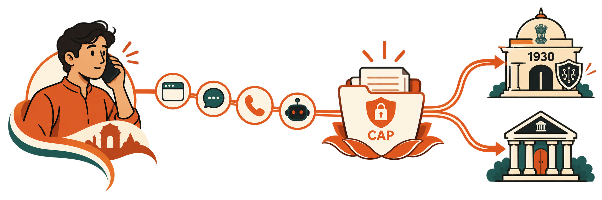

# Raksha

**Emergency cyber-fraud first response for India — one citizen case, four front doors, one Civic Action Protocol.**

[](https://www.typescriptlang.org/)
[](#civic-action-protocol-cap)
[](https://nodejs.org/)
[](LICENSE)

<p align="center">
  
</p>

<p align="center">
  <strong>You speak once. We carry it through.</strong><br/>
  <em>Call · WhatsApp · Web · AI agents → one verified case → simulated 1930 &amp; bank desks</em>
</p>

| Surface | URL |
| :--- | :--- |
| **Citizen website** | [raksha-theta.vercel.app](https://raksha-theta.vercel.app) |
| **Protocol host** | [raksha-protocol.onrender.com](https://raksha-protocol.onrender.com/health) |
| **Portal A (1930 desk)** | […/portal-a](https://raksha-protocol.onrender.com/portal-a) |
| **Portal B (bank desk)** | […/portal-b](https://raksha-protocol.onrender.com/portal-b) |

---

## Why Raksha exists

When someone loses money to a cyber scam, the first hours matter. Today the path is fragmented: long forms, separate government and bank portals, and no durable way for a distressed citizen to **speak once** and stay with the same case across channels.

Emerging AI agents face the same wall from the other side — they scrape websites instead of calling a safe, auditable public-service action layer.

**Raksha** is not another portal to master. It is a **citizen-facing orchestration layer** around a single **Civic Action Protocol (CAP)**. Institutions expose actions and status; Raksha carries the citizen journey — intake, confirmation, filing, tracking, and follow-up — across the interfaces people already use.

> India does not need more websites that teach citizens how to navigate the system.  
> It needs systems that adapt to citizens — simply.

---

## What we built

### Product thesis

| Principle | Meaning in product |
| :--- | :--- |
| **One case identity** | A single `RKS-*` incident persists across Web, WhatsApp, and Phone |
| **Speak once** | Multimodal intake (voice, text, receipt) → verified fields → citizen confirms → file |
| **Carry it through** | CAP handoff to simulated **1930** (Portal A) and **bank** (Portal B) desks |
| **Stay with the citizen** | Status lookup + citizen-authorized **follow-up** when the desk is quiet — not “rebuild government” |
| **Honest simulation** | Live demo uses `1930-SYN-*` references; downstream desks are labeled simulated |

### Four convergent front doors

```text
       HUMAN INTERFACES                             AI INTERFACES
  ┌──────────┼──────────┐                                 │
  ▼          ▼          ▼                                 ▼
 Web      WhatsApp    Phone                      Autonomous AI Agents
 (UI)     (Twilio)  (ElevenLabs)                 (MCP / Claude / GPT)
  │          │          │                                 │
  └──────────┼──────────┴─────────────────────────────────┘
             ▼
      POST /v1/process  →  Raksha Core  →  CAP  →  Portal A / Portal B
```

| Channel | Role |
| :--- | :--- |
| **Web** (`/app`) | Emergency UI — story, UTR, amount, bank, confirm, track |
| **WhatsApp** | Twilio sandbox pilot — narrative, STATUS, YES follow-up |
| **Phone** | ElevenLabs + Twilio voice — language pick, intake, status, follow-up |
| **MCP** | Tool surface for agents — capability discovery + guarded submit |

### Citizen persistence (Track → Understand → Follow up)

After filing, the citizen should not restart from zero:

1. **Track** — `STATUS` / “I already reported” / `raksha_get_status` resolves the case by mobile or `RKS-*`
2. **Understand** — spoken / WhatsApp status explains desk wait windows without inventing institutional failure
3. **Follow up** — when the case clock is stale (demo: ~1 minute under `DEMO_MODE` / Render), the citizen can authorize a **follow-up** on the **same** case; Portal A timeline records it; WhatsApp can notify the filing mobile

Deep link example after filing:

`https://raksha-protocol.onrender.com/portal-a/?ref=1930-SYN-********`

---

## Civic Action Protocol (CAP)

CAP is the machine-action layer: idempotent actions, capability discovery, and a tamper-evident event trail.

- Institutions only need to expose **actions** and **status** Raksha can connect to
- Raksha owns citizen orchestration, confirmation, and channel UX
- Production can move sensitive inference to sovereign infrastructure while keeping the **same protocol interface**

Key demo actions include `report_financial_fraud` and `follow_up_case`. Events such as `incident.accepted` and `case.followed_up` drive Portal A / WhatsApp subscribers.

Contract details: [docs/cap-contract.md](docs/cap-contract.md)

---

## Architecture & hosts

```text
Vercel (citizen website)
└── /, /how, /agents, /cap, /app, /images/*
    /app talks to the protocol origin over HTTPS + CORS

Render (protocol host) — https://raksha-protocol.onrender.com
├── /v1/*            Core incident & extraction engine
├── /cap/*           Civic Action Protocol
├── /portal-a        Simulated 1930 intake desk
├── /portal-b        Simulated bank freeze desk
├── /whatsapp/*      WhatsApp webhook adapter
├── /phone/*         Telephony / ElevenLabs tools
├── /mcp/*           Model Context Protocol server
└── /health          Liveness

Postgres (Render / Supabase pool)
└── Persistent incidents, evidence, CAP events, audit
```

Marketing HTML is pre-rendered (`pnpm export:web`) and served from Vercel’s CDN. Render runs the long-lived Node gateway (`pnpm start` → `scripts/prod-server.ts`).

Full notes: [docs/architecture.md](docs/architecture.md) · [docs/deployment.md](docs/deployment.md)

---

## Live demo storyboard (two minutes)

**Minute 1 — File**

1. Open the website hero: *“You speak once. We carry it through.”*
2. File via Web `/app`, WhatsApp, or Phone with a clear story (amount, bank, 12-digit UTR)
3. Citizen confirms → CAP accept → `1930-SYN-*` reference → Portal A shows the case

**Minute 2 — Persist**

1. Black beat: reporting is not the end — days later the citizen returns
2. WhatsApp `STATUS` **or** phone “I already reported” → status on the same `RKS-*`
3. When follow-up is offered → citizen says **yes** → Portal A timeline + WhatsApp notify

Scripts and judge notes: [docs/demo.md](docs/demo.md)

### Phone status tip (outbound)

Outbound Twilio callee ID may differ from the **filing mobile**. The voice agent accepts a spoken mobile / `RKS-*` on `raksha_get_status` / `raksha_follow_up` so lookup follows the filed case, not only the dialed number.

---

## Quick start (local)

```bash
pnpm install
pnpm build
pnpm typecheck

# Full stack + demo bootstrap
pnpm demo
```

| Service | Local | Description |
| :--- | :--- | :--- |
| Citizen web | `:3000` | Landing, How, Agents, CAP, `/app` |
| Core API | `:3001` | Process, incidents, citizen-case view |
| CAP | `:3002` | Actions, events, audit |
| Portal A / B | `:3003` / `:3004` | Simulated desks |
| WhatsApp / Phone / MCP | `:3005`–`:3007` | Channel adapters |

Copy `.env.example` → `.env.local`. **Never commit real secrets** (`.env*` is gitignored; only synthetic placeholders live in `.env.example`).

---

## Tests

```bash
pnpm test
```

Coverage includes quad-channel parity, multilingual turns, contradiction handling, CAP outage → `DEFERRED`, audit digests, portal acknowledgment, and persistence recovery. Additional citizen-persist RC coverage lives in `test/citizen-persist-rc.test.ts`.

---

## Simulation boundary (claims honesty)

- Downstream **1930** and **bank** desks are **simulated** for the prototype
- External references are prefixed **`1930-SYN-`**
- UI and status copy label “simulated downstream service”
- CAP event pipeline and case identity are real within the protocol host

---

## Repository map

```text
apps/web              Citizen website (Vercel export)
apps/portal-a|b       Simulated institutional desks
agents/phone|whatsapp|mcp
services/core|cap     Incident engine + CAP router
packages/*            Shared schemas, i18n, CAP SDK
scripts/              prod-server, export-web, demo, ElevenLabs config
docs/                 Architecture, CAP contract, demo, deployment
```

---

## Production deploy checklist

1. **Render** (`raksha-protocol`, branch `main`) — protocol host + Postgres  
2. **Vercel** (`raksha`) — `pnpm export:web` then production deploy of `apps/web/out`  
3. Env on Render: `DEMO_MODE=true`, `PROTOCOL_PUBLIC_ORIGIN`, Twilio / ElevenLabs / Gemini keys (dashboard only)  
4. Env on Vercel: `PROTOCOL_PUBLIC_ORIGIN=https://raksha-protocol.onrender.com`  
5. Verify: `/health`, `/portal-a/cases`, website hero copy, `/app` against live Core

Website redeploy from repo root:

```bash
pnpm export:web
npx vercel --prod --yes
```

---

## Documentation

- [Architecture](docs/architecture.md)
- [CAP contract](docs/cap-contract.md)
- [Live demo guide](docs/demo.md)
- [Deployment](docs/deployment.md)
- [Contributing](docs/CONTRIBUTING.md)

---

## Closing thesis

People should not need to learn how government software works in an emergency. AI agents should not have to pretend government websites are APIs.

**Raksha gives humans and agents one safe path to the same public-service action** — so we stop building more interfaces that teach users how to navigate, and start making technology adapt to them in the simplest form that makes their lives lighter.
