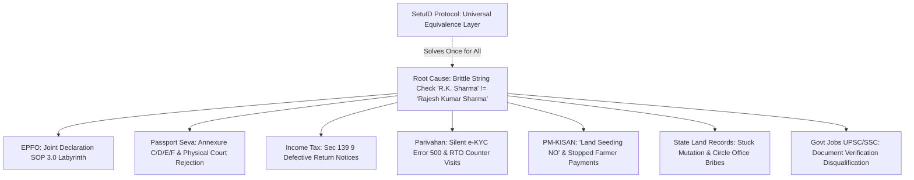

# SetuID: The Identity Equivalence Protocol for Digital India

> **Hackathon Submission Champion Track**  
> **Event:** Build What Moves India (Presented by Varun Mayya x OpenAI)  
> **Strategic Angle:** The "UPI-Style Protocol" vs "A Nicer Form"  
> **Core Value Proposition:** One shared verification layer that eliminates name-mismatch rejections across every single Indian public department (EPFO, Passport Seva, Income Tax, Parivahan, Land Records, PM-KISAN).

---

## 1. Executive Summary & The "India Stack 5th Pillar" Thesis

### A. The Structural Insight: UX Fix vs. Protocol Rail
- **A UX Fix** = *"We redesigned this one government form to make it look modern."* (Single-department, incremental, fragile).
- **A UPI-Style Idea** = *"We built the missing foundational rail that 10 different departments were independently hacking around."* (Systemic, high-leverage, infrastructure-level).

```
┌─────────────────────────────────────────────────────────────────────────────┐
│                           THE EVOLUTION OF INDIA STACK                      │
├───────────────────┬─────────────────────────────────────────────────────────┤
│ Pillar            │ Problem Solved                                          │
├───────────────────┼─────────────────────────────────────────────────────────┤
│ 1. Aadhaar        │ Authentication — "Who are you?"                         │
│ 2. DigiLocker     │ Credential Storage — "Where are your verified records?" │
│ 3. UPI            │ Interoperable Payments — "How does money move?"         │
│ 4. Account Aggr.  │ Financial Consent — "How does financial history move?"  │
├───────────────────┼─────────────────────────────────────────────────────────┤
│ 5. SetuID (OURS)  │ Identity Equivalence — "Are these records the same me?" │
└───────────────────┴─────────────────────────────────────────────────────────┘
```

UPI didn't win because it had a pretty app interface; it won because it established a **single interoperable standard** so no bank or merchant ever had to build payment routing plumbing again. 

**SetuID does the exact same thing for Identity Equivalence.**

---

## 2. The 10-Department Downstream Failure Chain

India has 1.4 billion people, 22 official languages, and hundreds of naming traditions (initials, patronymics, village prefixes, post-marriage surname changes, caste title honorifics, and varying English phonetic transliterations).

Today, every government database performs a **naive, brittle binary string comparison** (`Aadhaar.name === Department.name`). When that binary check fails, every department independently invents its own broken, manual, bureaucratic duct-tape:



---

## 3. The Core Technology: How OpenAI / Codex Powers SetuID

Deterministic regex or simple Levenshtein distance fails completely on Indian names (`Lakshmi` vs `Laxmi` has an edit distance of 2, but is 100% equivalent; `K. S. Raman` vs `Kallidaikurichi Sankaranarayanan Raman` has huge edit distance but represents the same person).

SetuID uses an **OpenAI-Powered Semantic Equivalence Engine** with 4 specialized modules:

```
[DigiLocker Verified Credentials (Aadhaar, PAN, DL, Marksheet XML/JSON)]
                                   │
                                   ▼
┌─────────────────────────────────────────────────────────────────────────┐
│                    SETUID IDENTITY EQUIVALENCE ENGINE                   │
├─────────────────────────────────────────────────────────────────────────┤
│                                                                         │
│  [1] Indic Phonetic & Script Transliteration Graph                      │
│      • Double Metaphone + Regional Vowel Normalization                  │
│      • (e.g., Sreedhar <-> Sridhar, Choudhary <-> Chowdhury)            │
│                                                                         │
│  [2] Expandable Initial Matcher (EIM)                                   │
│      • Dissects initials against Father's Name & Native Village tokens  │
│      • (e.g., 'K.S. Rao' resolved via Father 'Sankaranarayanan')        │
│                                                                         │
│  [3] Temporal & Demographic Subsumption Logic                           │
│      • Aadhaar 'DOB: 1972' (Year-only) subsumed by Marksheet '12-04-1972'│
│                                                                         │
│  [4] Shortest Correction Dependency DAG Engine                          │
│      • Calculates: Fix Aadhaar first -> Sync PAN -> Issue Attestation   │
│                                                                         │
└──────────────────────────────────┬──────────────────────────────────────┘
                                   │
                 ┌─────────────────┴─────────────────┐
                 ▼                                   ▼
[Machine-Readable Protocol Layer]   [Human/Legal Enforcement Layer]
 • W3C Verifiable Credential Token   • Notarized "One & Same Person" Affidavit
 • JSON-LD Equivalence Attestation   • Central Gazette Submission Dossier
 • REST API: `POST /v1/reconcile`    • EPFO Joint Declaration SOP 3.0 PDF
```

---

## 4. The Hackathon Submission Strategy: Narrow Demo, Protocol Architecture

To comply with the hackathon's strict rule (*"Every feature you demo must work live; no vaporware"*), we execute a two-layer strategy:

```
┌─────────────────────────────────────────────────────────────────────────────┐
│                       THE WINNING VIDEO STRUCTURE                           │
├─────────────────────────────────────────────────────────────────────────────┤
│                                                                             │
│  MINUTE 0:00 - 1:00 (The Citizen Journey - The "Magic Moment")              │
│  • Persona: Ramesh Kumar Sharma (54, retired teacher).                      │
│  • Problem: ₹4.8L EPF claim rejected, Passport renewal blocked, and         │
│    PM-KISAN stopped due to slight spelling differences across 4 IDs.        │
│  • Action: Ramesh connects DigiLocker -> SetuID resolves the multi-document │
│    graph in 3 seconds -> Shows 98% equivalence proof -> Generates his       │
│    official Notarized "One and the Same Person" Stamp Affidavit & EPFO pack.│
│                                                                             │
│  MINUTE 1:00 - 2:00 (The Protocol Architecture - The Big Idea)              │
│  • The UPI Framing: "UPI stopped banks from building custom payment plumbing.│
│    SetuID stops departments from building custom rejection forms."          │
│  • Show the Developer API: Live call to `POST /api/reconcile` returning     │
│    verifiable cryptographic equivalence tokens with Zod schema validation.  │
│  • Explain how EPFO, Passport Seva, and Income Tax can plug in with 1 line. │
│                                                                             │
└─────────────────────────────────────────────────────────────────────────────┘
```

---

## 5. Developer API Specification (`POST /v1/identity/reconcile`)

### Request Payload:
```json
{
  "anchor_document": {
    "type": "CLASS_10_MARKSHEET",
    "issuer": "CBSE",
    "name": "Rajesh Kumar Sharma",
    "dob": "1972-04-12",
    "father_name": "Om Prakash Sharma"
  },
  "target_documents": [
    {
      "type": "AADHAAR_XML",
      "issuer": "UIDAI",
      "name": "Rajesh Kumar Sharma",
      "dob": "1972",
      "father_name": "O. P. Sharma"
    },
    {
      "type": "PAN_RECORD",
      "issuer": "INCOME_TAX_DEPT",
      "name": "Rajesh Sharma",
      "dob": "1972-04-12",
      "father_name": "Om Prakash Sharma"
    },
    {
      "type": "EPFO_MEMBER_RECORD",
      "issuer": "EPFO",
      "name": "Rajesh K Sharma",
      "dob": "1972-04-12",
      "father_name": "O P Sharma"
    }
  ]
}
```

### Response Payload (Instant Protocol Output):
```json
{
  "equivalence_verdict": "IDENTICAL_LIVING_INDIVIDUAL",
  "overall_confidence_score": 0.982,
  "discrepancy_analysis": [
    {
      "target_doc": "PAN_RECORD",
      "field": "NAME",
      "variance_type": "MIDDLE_NAME_OMISSION",
      "risk_level": "LOW_LEGAL_VARIANCE",
      "is_semantically_equivalent": true
    },
    {
      "target_doc": "EPFO_MEMBER_RECORD",
      "field": "NAME",
      "variance_type": "INITIAL_ABBREVIATION",
      "risk_level": "HIGH_GOVT_PORTAL_BLOCKER",
      "remediation_statutory_path": "EPFO_SOP_3_0_MINOR_CORRECTION"
    },
    {
      "target_doc": "AADHAAR_XML",
      "field": "DOB",
      "variance_type": "TEMPORAL_YEAR_ONLY_SUBSUMPTION",
      "risk_level": "CRITICAL_PASSPORT_BLOCKER",
      "remediation_statutory_path": "UIDAI_ONLINE_DOB_SYNC"
    }
  ],
  "verifiable_attestation_token": "eyJhbGciOiJSUzI1NiIsInR5cCI6IkpXVCJ9...",
  "generated_legal_artifacts": {
    "one_and_same_person_affidavit_pdf": "/api/artifacts/affidavit_rajesh_sharma.pdf",
    "epfo_joint_declaration_pdf": "/api/artifacts/epfo_jd_rajesh_sharma.pdf",
    "central_gazette_kit_zip": "/api/artifacts/gazette_kit_rajesh_sharma.zip"
  }
}
```

---

## 6. Technical Implementation Blueprint

1. **Frontend:** Next.js 15 (App Router), TypeScript, Tailwind CSS, Lucide Icons, Shadcn UI, Framer Motion for smooth graph resolution animations.
2. **AI Layer:** OpenAI GPT-4o with structured Zod outputs (`response_format: { type: "json_object" }`).
3. **Mock Data Layer:** Pre-seeded with 3 realistic Indian citizen profiles:
   - *Persona 1:* **Ramesh Kumar Sharma** (Salaried worker with initials/middle name drops).
   - *Persona 2:* **Pooja Iyer (née Pooja Sharma)** (Post-marriage surname & father/spouse name transition).
   - *Persona 3:* **K. S. Ramanathan** (South Indian village/father initial expansion for passport & UPSC).
4. **Client-Side PDF Generation:** `@react-pdf/renderer` generating official ₹10/₹100 non-judicial stamp paper affidavits, Gazette application forms, and EPFO Joint Declaration SOP 3.0 documents.

---

*This document serves as the master blueprint for our hackathon build.*
