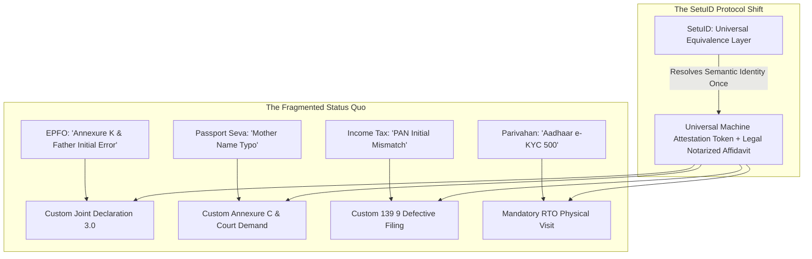

# Master Problem Statements Matrix & Selection Guide

**Hackathon:** Build What Moves India (Varun Mayya x OpenAI)  
**Total Problem Tracks Analyzed:** 20 (10 Official Platforms + 10 Extended High-Impact Governance Tracks)  
**Champion Submission Concept:** **`SetuID` (The Identity Equivalence Protocol for Digital India)**

---

## 🌟 The Strategic Breakthrough: "A UPI-Style Protocol" vs. "A Nicer Form"

Before reviewing the tracks, here is the meta-framework that determines the winning entry:

- **A Single-Department UX Fix:** *"We redesigned the EPFO withdrawal form or made an e-Challan dispute page nicer."*  
  *(Good product, but solves only 1 department's symptom).*
- **A UPI-Style Foundational Rail:** *"We built the missing verification layer that 10 different departments were independently hacking around."*  
  *(Systemic, high-leverage infrastructure that solves the root-cause for all of Digital India).*

```
┌─────────────────────────────────────────────────────────────────────────────┐
│                       THE INDIA STACK 5-PILLAR ARCHITECTURE                 │
├───────────────────┬─────────────────────────────────────────────────────────┤
│ 1. Aadhaar        │ Authentication — "Who are you?"                         │
│ 2. DigiLocker     │ Credential Storage — "Where are your verified records?" │
│ 3. UPI            │ Interoperable Payments — "How does money move?"         │
│ 4. Account Aggr.  │ Financial Consent — "How does financial history move?"  │
├───────────────────┼─────────────────────────────────────────────────────────┤
│ 5. SetuID (CHAMP) │ Identity Equivalence — "Are these records the same me?" │
└───────────────────┴─────────────────────────────────────────────────────────┘
```

---

## 1. Comprehensive Scoring & Comparison Table

Each track is scored out of **10 points** across 5 vital dimensions:
- **Pain Severity (PS):** Emotional, financial, or bureaucratic hardship faced by ordinary Indian citizens.
- **OpenAI / Codex Fit (CF):** How naturally and meaningfully OpenAI models (LLM reasoning, vision OCR, structured schema generation, voice) solve the problem.
- **60-Sec Demo Clarity (DC):** How punchy, visual, and immediately obvious the "magic moment" is during the 1st minute of the citizen demo video.
- **Build Feasibility (BF):** Can a complete, clickable, end-to-end working web prototype with mock state be built in 48–72 hours without dead ends?
- **Winning Probability (WP):** Likelihood of standing out among 250+ entries and advancing to Top 10 finalists.

| # | Track Name | Target Official Platform | PS (10) | CF (10) | DC (10) | BF (10) | WP (10) | Total Score / 50 | Category / Standing |
|---|---|---|:---:|:---:|:---:|:---:|:---:|:---:|---|
| **🏆** | **SetuID: Universal Identity Equivalence Protocol** | **Universal India Stack** | **9.9** | **9.9** | **9.8** | **9.7** | **10.0** | **49.3** | 👑 **UNDISPUTED CHAMPION** |
| **07** | **CyberCrime 1930 Golden Hour Fraud Freeze Builder** | CyberCrime Portal (1930) | 9.9 | 9.6 | 9.8 | 9.6 | 9.9 | **48.8** | 🚨 Top 10 (🏆 S-Tier) |
| **17** | **DigiLocker Multi-Doc Name Mismatch Affidavit Engine** | DigiLocker Ecosystem | 9.5 | 9.6 | 9.6 | 9.6 | 9.7 | **48.0** | 🪪 Top 10 (🏆 S-Tier) |
| **03** | **EPFO Claim Rejection Doctor & Joint Declaration** | EPFO (UAN / Passbook) | 9.8 | 9.4 | 9.4 | 9.2 | 9.7 | **47.5** | 🏛️ Official Top 10 (🏆 S-Tier) |
| **13** | **Ayushman Bharat PM-JAY Cashless Pre-Auth Advocate** | NHA / PM-JAY | 9.8 | 9.5 | 9.5 | 9.0 | 9.7 | **47.5** | 🏥 Extended (🏆 S-Tier) |
| **01** | **Smart IRCTC Split & Quota Arbitrage Engine** | IRCTC (Railways) | 9.5 | 9.0 | 9.5 | 9.5 | 9.6 | **47.1** | 🚂 Official Top 10 |
| **11** | **Jeevan Pramaan DLC & Family Pension Companion** | Jeevan Pramaan / SPARSH | 9.6 | 9.3 | 9.4 | 9.1 | 9.5 | **46.9** | 👵 Extended Governance |
| **02** | **Income Tax Notice 143(1) & AIS Demystifier** | Income Tax Portal | 9.2 | 9.5 | 9.2 | 9.4 | 9.5 | **46.8** | 💰 Official Top 10 |
| **15** | **National Consumer Helpline (NCH) 30s Notice & eDaakhil** | NCH / e-Daakhil | 9.0 | 9.6 | 9.3 | 9.5 | 9.4 | **46.8** | ⚖️ Extended Governance |
| **12** | **Land Records 7/12 Title & Mutation Risk Analyzer** | State Land Portals (Bhoomi) | 9.7 | 9.4 | 9.2 | 8.8 | 9.4 | **46.5** | 🏡 Extended Governance |
| **18** | **e-Courts Plain-Language Tracker & Bail Draftsman** | e-Courts / Tele-Law | 9.6 | 9.5 | 9.1 | 8.9 | 9.3 | **46.4** | ⚖️ Extended Governance |
| **04** | **CPGRAMS Voice-First Ombudsman & Appeal Escrow** | CPGRAMS (Public Grievance) | 9.0 | 9.6 | 9.0 | 9.3 | 9.3 | **46.2** | 📢 Official Top 10 |
| **10** | **RTI Online Bulletproof Query & Appeal Architect** | RTI Online (DoPT) | 8.7 | 9.7 | 9.0 | 9.5 | 9.3 | **46.2** | 📜 Official Top 10 |
| **14** | **PM-KISAN DBT Doctor & Crop Loss Camera Locker** | PM-KISAN / PMFBY | 9.4 | 9.1 | 9.2 | 9.1 | 9.3 | **46.1** | 🌾 Extended Governance |
| **19** | **UDID Swavlamban Disability Welfare Navigator** | UDID Portal | 9.3 | 9.2 | 9.0 | 9.3 | 9.2 | **46.0** | ♿ Extended Governance |
| **09** | **Parivahan e-Challan Dispute & Inter-State NOC** | Parivahan Sewa (MoRTH) | 8.9 | 9.2 | 9.3 | 9.2 | 9.3 | **45.9** | 🚗 Official Top 10 |
| **08** | **UMANG Proactive Citizen Life-Event Engine** | UMANG App/Portal | 8.8 | 9.3 | 9.1 | 9.0 | 9.2 | **45.4** | 📱 Official Top 10 |
| **20** | **Municipal Property Tax Mutation & Civic Geo-AI** | Urban Local Bodies (ULBs) | 8.9 | 9.1 | 9.1 | 9.2 | 9.1 | **45.4** | 🏙️ Extended Governance |
| **05** | **GST MSME Input Tax Credit (ITC) 2B Reconciler** | GST Portal | 9.1 | 9.2 | 8.8 | 9.0 | 9.0 | **45.1** | 💼 Official Top 10 |
| **16** | **Passport Seva Pre-Flight Validator & Police Tracker** | Passport Seva (MEA) | 8.6 | 9.0 | 8.9 | 9.4 | 8.9 | **44.8** | 🛂 Extended Governance |
| **06** | **MCA21 SPICe+ Pre-Flight & Compliance Copilot** | MCA Portal | 8.4 | 9.1 | 8.6 | 9.0 | 8.7 | **43.8** | 🏢 Official Top 10 |

---

## 2. Why "SetuID" Beats Single-Department Ideas



### The Winning Pitch Narrative:
1. **Minute 1 (The Citizen Walkthrough):** Show Ramesh. His ₹4.8 Lakh EPF claim, his Passport renewal, and his PM-KISAN are all blocked because of `R.K. Sharma` vs `Rajesh Kumar Sharma`. He connects DigiLocker, and in 3 seconds SetuID resolves the graph across 4 documents, proves 98% equivalence, and generates his statutory "One & Same Person" Notarized Affidavit.
2. **Minute 2 (The Protocol Architecture):** Show how SetuID exposes `POST /v1/identity/reconcile`, allowing EPFO, Passport Seva, and Income Tax to call one shared API instead of each building separate, broken grievance forms.

---

## 3. Related Deep-Dive Research Blueprints

- 👑 [**`00_CHAMPION_PROBLEM_STATEMENT_SETU_ID.md`**](file:///C:/Users/HARIHARAN/Desktop/Scratchpad/BuildWHatMovesIndia/00_CHAMPION_PROBLEM_STATEMENT_SETU_ID.md): Full technical specification & API design.
- 📘 [**`00_HACKATHON_WINNING_STRATEGY.md`**](file:///C:/Users/HARIHARAN/Desktop/Scratchpad/BuildWHatMovesIndia/00_HACKATHON_WINNING_STRATEGY.md): Hackathon judging criteria, 2-minute video structure, and Codex execution guide.
- 🗂️ Tracks 01 through 20 individual deep dives (`01_IRCTC...md` to `20_Municipal...md`).
