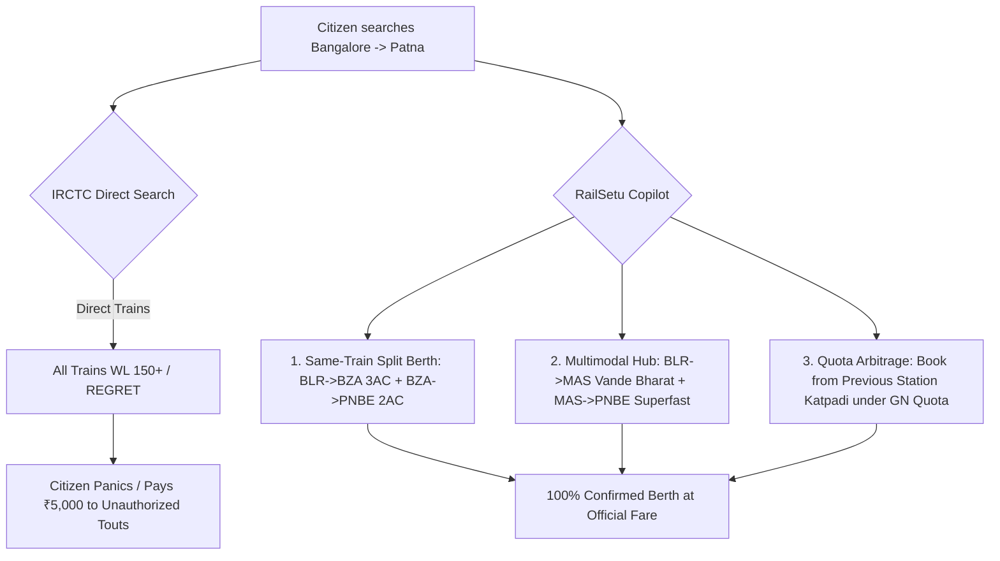

# Research Track 01: IRCTC — Smart Multimodal Route Solver & Quota Arbitrage Engine

**Target Official Platform:** IRCTC (Indian Railway Catering and Tourism Corporation) — `irctc.co.in`  
**Core Problem Area:** Tatkal seat booking chaos, WL (Waitlist) opacity, lack of split-ticketing intelligence, and missed connecting journeys.

---

## 1. Executive Pitch & Citizen Problem Statement

### The Problem
Every day, over 70 million Indian citizens battle the IRCTC portal. A passenger trying to travel from Bengaluru to Patna finds `WL 180` across all direct trains during festive or emergency travel. They assume no seats exist. In reality:
1. **Station Quota Fragmentation:** Seats are locked under different station quotas (General GN, Remote Location RLWL, Pooled Quota PQWL, Roadside Quota RSWL).
2. **Split-Ticketing Arbitrage:** The same train has 42 vacant seats from Bengaluru to Vijayawada in 3AC, and 18 vacant seats from Vijayawada to Patna in 2AC. Booking them together guarantees a confirmed journey on the exact same train.
3. **Connecting Hub Routing:** A passenger could take Vande Bharat to Chennai (100% available) and switch to a confirmed Rajdhani to Patna, but IRCTC's search only evaluates direct point-to-point routes.

### The Solution: "RailSetu"
An intelligent, natural language transit copilot powered by OpenAI:
- Citizen types or speaks: *"I need to reach Patna before Friday evening with my elderly father, budget ₹3,000 per person."*
- OpenAI reasoning engine calculates multi-leg split journeys, evaluates station-quota arbitrage, predicts chart preparation vacancy based on historical charting patterns, and produces an instant 1-click booking blueprint with zero cognitive friction.

---

## 2. Anatomy of the Current IRCTC Pain Points



### Key Failure Modes in Existing IRCTC UI:
- **CAPTCHA & Gateway Timeouts:** During 10:00 AM (AC) and 11:00 AM (Non-AC) Tatkal windows, session crashes cost users their 90-second booking window.
- **Dynamic Pricing Opacity:** Premium Tatkal fares surge to flight prices without warning.
- **Chart Preparation Disconnect:** Charts prepared 4 hours prior leave WL passengers stranded at the station without automated alternate bus/train rerouting.

---

## 3. The 60-Second Citizen Demo Journey

1. **Step 1 (0:00 - 0:15):** Citizen opens RailSetu web app. Types: *"Need 2 confirmed berths Delhi to Varanasi tomorrow morning. IRCTC shows WL 94."*
2. **Step 2 (0:15 - 0:30):** RailSetu instantly queries the synthetic railway schedule & seat matrix. It finds:
   - Option A: Same-train split booking on *Shiv Ganga Express* (Delhi -> Kanpur in Sleeper + Kanpur -> Varanasi in 3AC). Confirmed!
   - Option B: Boarding quota arbitrage: Booking from New Delhi to Mughal Sarai (under General Quota GN) with boarding at Varanasi. Confirmed!
3. **Step 3 (0:30 - 0:45):** Citizen toggles "Senior Citizen Lower Berth Preference" -> AI updates passenger details, verifies berth allocation rules (Section 60 of Railways Act), and shows total fare with breakups.
4. **Step 4 (0:45 - 1:00):** Citizen clicks **"Generate IRCTC One-Click Booking Payload"** -> Pre-fills passenger master list, auto-selects payment method, and generates backup itinerary if charting drops below 80% probability.

---

## 4. OpenAI / Codex Native Architecture

```
[User Voice / Natural Language Prompt]
                  │
                  ▼
   [OpenAI GPT-4o-mini Extraction]
  (Origin, Destination, Date, Class, Senior Citizen Flags)
                  │
                  ▼
    [Graph Route & Quota Optimizer (Python/Codex)]
  ┌──────────────────────────────────────────────────┐
  │ • Leg 1: Segment Splitter (Station A -> X -> B)  │
  │ • Leg 2: Quota Analyzer (GN vs PQWL vs RLWL)     │
  │ • Leg 3: Historical Chart Vacancy Predictor      │
  └──────────────────────────────────────────────────┘
                  │
                  ▼
  [Structured Output JSON (Zod Schema)]
  ┌──────────────────────────────────────────────────┐
  │ • confirmed_itineraries: [ { legs: [...], fare } ]│
  │ • fallback_plan: "Bus connection via State RTC"  │
  │ • irctc_quick_fill_payload: {...}                │
  └──────────────────────────────────────────────────┘
```

---

## 5. Synthetic Mock Schema (For Hackathon Prototype)

```json
{
  "train_number": "12560",
  "train_name": "Shiv Ganga Superfast Express",
  "search_route": {"origin": "NDLS", "destination": "BSB", "date": "2026-08-29"},
  "direct_status": {"class": "3A", "status": "WL 94", "confirmation_probability": "12%"},
  "solution_type": "SAME_TRAIN_SPLIT_BERTH",
  "split_journey": [
    {
      "segment": 1,
      "from": "NDLS (New Delhi)",
      "to": "CNB (Kanpur Central)",
      "class": "3A",
      "berth": "B3-24 (Lower)",
      "status": "AVAILABLE - 14",
      "fare": 740
    },
    {
      "segment": 2,
      "from": "CNB (Kanpur Central)",
      "to": "BSB (Varanasi Jn)",
      "class": "2A",
      "berth": "A1-12 (Side Lower)",
      "status": "AVAILABLE - 06",
      "fare": 890
    }
  ],
  "total_fare": 1630,
  "savings_vs_tatkal": 450,
  "confidence_score": "100% Confirmed"
}
```

---

## 6. The 2-Minute Video Pitch Script

- **Minute 1 (Citizen Experience):** "Every holiday season, millions of Indians face this screen: *Waitlist 120*. They give up or pay illegal touts. But look at RailSetu. I type: *'Need confirmed ticket to Varanasi tomorrow for me and my dad'*. In 2 seconds, RailSetu analyzes the train's internal coach layout and station quotas. It finds a split-berth on the exact same train — confirmed. No switching trains, no illegal agents, 100% legitimate Indian Railways quota optimization."
- **Minute 2 (Engineering & Codex):** "We built RailSetu using Next.js and OpenAI. We used Codex to generate our combinatorial station-graph search algorithm and quota constraint solver. GPT-4o parses complex natural language travel intents and generates deterministic, schema-validated booking payloads ready for IRCTC integration. All backends are 100% mocked with realistic Indian Railways schedules."
