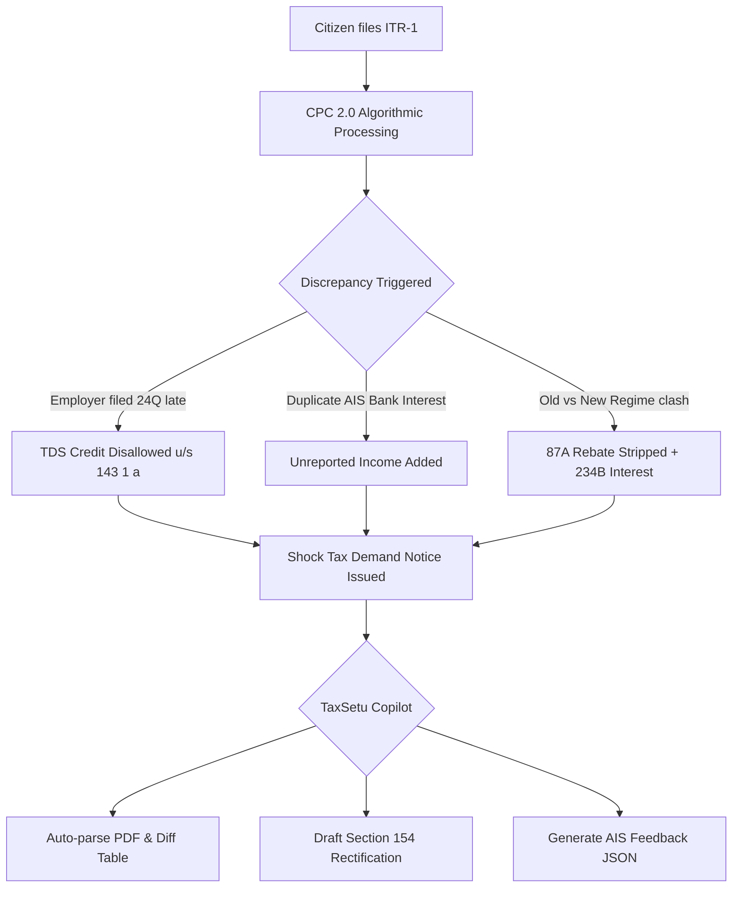

# Research Track 02: Income Tax e-Filing — Notice 143(1)/148 Demystifier & AIS Reconciler

**Target Official Platform:** Income Tax Department e-Filing Portal (`incometax.gov.in` / CPC 2.0)  
**Core Problem Area:** Automated demand notices under Section 143(1)(a), defective return notices u/s 139(9), AIS/TIS vs 26AS phantom income discrepancies, and the confusing Old vs New Tax Regime (Section 115BAC) trade-offs.

---

## 1. Executive Pitch & Citizen Problem Statement

### The Problem
Over 75 million Indians file income tax returns annually. Millions of salaried citizens and freelancers open their email to find a terrifying automated notice:
- **Section 143(1) Intimation:** A sudden demand of ₹45,000 with cryptic comparison tables where CPC algorithms disallowed TDS or 87A rebate because of a minor timing difference between employer Form 24Q and Form 26AS.
- **The AIS Ghost Income Trap:** AIS reports duplicate entries (e.g. quarterly bank interest reported 4 times plus 1 consolidated entry), leading to automated defective notices.
- **Cost of Resolution:** A Chartered Accountant (CA) charges ₹2,000–₹5,000 just to file a simple Section 154 rectification, while ordinary citizens panic about bank account attachments.

### The Solution: "TaxSetu"
An intelligent, document-aware tax defense copilot powered by OpenAI:
- Citizen uploads their 143(1) notice PDF or AIS JSON.
- OpenAI extracts the exact line-item discrepancies, translates tax jargon into plain English/Hindi, identifies whether the demand is mistaken or valid, and auto-generates a ready-to-submit **Section 154 Rectification Petition** and **AIS Feedback Payload** in 30 seconds.

---

## 2. Technical Failure Modes in Income Tax Portal



### Common Error Codes & Notices:
- **`EF20001`:** DOB / Name mismatch between PAN database and ITR schema.
- **Section 143(1)(a):** Inconsistency in deductions under Chapter VI-A or mismatch between Schedule TDS and Form 26AS.
- **Section 139(9):** Defective return notice giving 15 days to upload corrected schedules or face return nullification.
- **Section 234A/B/C:** Compounding penal interest added automatically to algorithmic demands.

---

## 3. The 60-Second Citizen Demo Journey

1. **Step 1 (0:00 - 0:15):** Citizen drops a mock Section 143(1) Intimation PDF showing a sudden ₹38,400 tax demand for Assessment Year 2025-26.
2. **Step 2 (0:15 - 0:30):** TaxSetu's Vision + Reasoning parser extracts the dual-column comparison table within 3 seconds:
   - *Issue 1:* ₹25,000 Employer TDS was disallowed because TAN was matched against Quarter 4 only.
   - *Issue 2:* ₹13,400 was added due to duplicated bank savings interest in AIS.
3. **Step 3 (0:30 - 0:45):** Citizen toggles vernacular mode (Hindi/Tamil): TaxSetu explains in plain voice: *"Aapki company ne TDS file karne me deri ki thi, isiliye CPC ne credit nahi diya. Aapko yeh tax nahi bharna hai."*
4. **Step 4 (0:45 - 1:00):** Citizen clicks **"Generate 1-Click Rectification Dossier"** -> Generates the formal Section 154 online response text, the updated Schedule TDS reconciliation, and the AIS Feedback JSON file ready to upload.

---

## 4. OpenAI / Codex Native Architecture

```
[Uploaded Notice PDF / AIS JSON]
                │
                ▼
   [GPT-4o Vision & Document Parser]
 (Extracts: Taxpayer PAN, Section, Demand Slabs, Discrepancies)
                │
                ▼
   [Statutory Tax Reasoning Engine (Codex)]
 ┌──────────────────────────────────────────────────┐
 │ • Income Tax Act 1961 (Sec 143(1), 154, 139(9))   │
 │ • Rule 37BA (Credit for tax deducted at source)  │
 │ • Section 87A Marginal Relief Simulator           │
 └──────────────────────────────────────────────────┘
                │
                ▼
 [Structured Output (Zod Schema / JSON)]
 ┌──────────────────────────────────────────────────┐
 │ • root_cause_diagnosis: "TDS Timing Discrepancy" │
 │ • liability_status: "FALSE_DEMAND_ZERO_PAYABLE"  │
 │ • section_154_draft_text: "..."                  │
 │ • ais_feedback_corrections: [ {...} ]            │
 └──────────────────────────────────────────────────┘
```

---

## 5. Synthetic Mock Schema (For Hackathon Prototype)

```json
{
  "notice_metadata": {
    "notice_section": "143(1)(a)",
    "din_number": "CPC/2425/A1/9812739102",
    "assessment_year": "2025-26",
    "pan": "ABCDE1234F",
    "total_demand_raised": 38400
  },
  "discrepancies": [
    {
      "category": "TDS_CREDIT_DISALLOWED",
      "claimed_in_itr": 25000,
      "allowed_by_cpc": 0,
      "variance": 25000,
      "statutory_rule": "Rule 37BA of Income Tax Rules 1962",
      "diagnosis": "Employer filed Form 24Q revised return after July 31. Credit now available in Form 26AS."
    },
    {
      "category": "AIS_DUPLICATE_INTEREST",
      "claimed_in_itr": 12000,
      "added_by_cpc": 25400,
      "variance": 13400,
      "diagnosis": "SBI Bank reported quarterly interest as well as annual consolidated interest in SFT-005."
    }
  ],
  "resolution_plan": {
    "recommended_action": "FILE_SECTION_154_RECTIFICATION",
    "actual_tax_payable": 0,
    "eligible_refund": 1200,
    "ais_feedback_required": true
  }
}
```

---

## 6. The 2-Minute Video Pitch Script

- **Minute 1 (Citizen Experience):** "Meet Ankit, a freelance software developer. He filed his taxes on time, but CPC sent him a ₹38,400 tax demand with compounding interest under Section 234B. He has no idea why. He uploads the notice to TaxSetu. In 3 seconds, TaxSetu pinpoints that the bank double-counted his interest in AIS, and his client's TDS was credited a week late. TaxSetu translates the entire legal notice into plain language and generates a Section 154 rectification response that reduces his demand from ₹38,400 to zero."
- **Minute 2 (Engineering & Codex):** "We used Codex to build our multi-column tax parser and the Section 115BAC regime comparison engine. OpenAI GPT-4o extracts tabular tax discrepancies from unstructured PDFs and maps them to statutory sections under the Income Tax Act 1961. The entire solution operates in a sandbox with zero real PII, providing instant consumer peace of mind."
