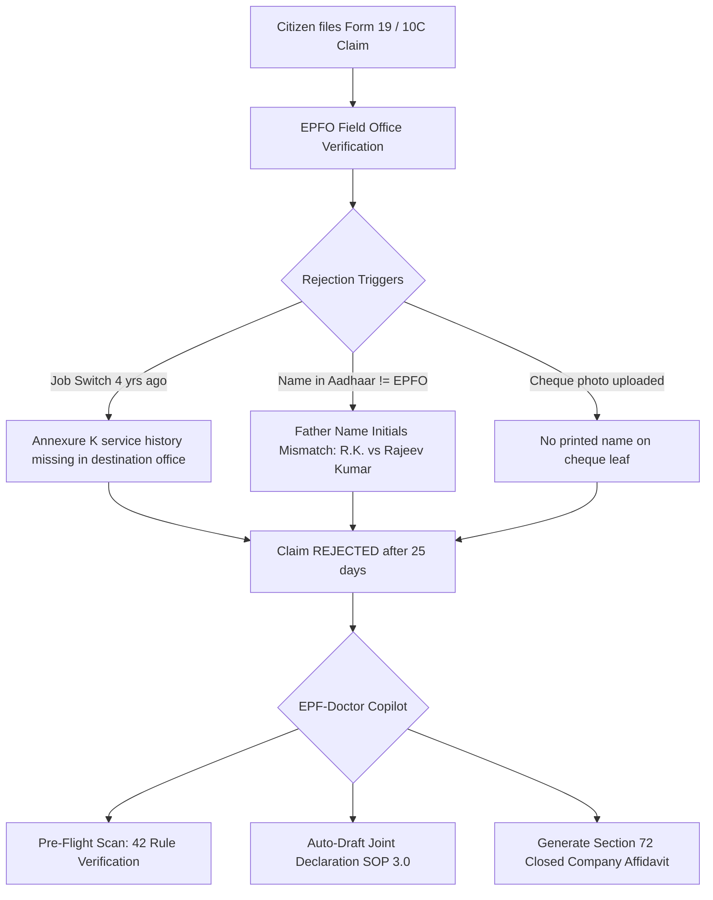

# Research Track 03: EPFO — Unified Claim Rejection Doctor & Joint Declaration Assistant

**Target Official Platform:** EPFO (Employees' Provident Fund Organisation) — Member e-Sewa Portal (`unifiedportal-mem.epfindia.gov.in`)  
**Core Problem Area:** ~34% claim rejection rate for Form 19 / 10C / 31 withdrawals, missing "Annexure K" across job transfers, father's name initials mismatch, un-seeded Date of Exit, and bereavement death claim deadlocks.

---

## 1. Executive Pitch & Citizen Problem Statement

### The Problem
Over 6.7 crore formal workers contribute to the Employees' Provident Fund (EPFO), holding ₹1.5+ lakh crore in lifetime savings. Yet, over **1.6 crore withdrawal and transfer claims are rejected every year (34% rejection rate)**:
1. **The Cryptic Rejection Loop:** A tech employee or factory worker waits 25 days only to receive a 1-line rejection SMS: *"Claim rejected: Annexure K not found"* or *"Father name mismatch"*.
2. **The Joint Declaration SOP 3.0 Trap:** To correct a single initial in a name, EPFO requires a physical/digital Joint Declaration attested by both the current employer and previous employer, plus 3 gazetted proofs. If the previous employer is shut down, the citizen is trapped.
3. **Missing Date of Exit (DOE):** If an employer fails to mark the exit date on the ECR portal, the employee cannot withdraw PF or transfer service history.

### The Solution: "EPF-Doctor"
A forensic pre-flight auditor and automated resolution engine powered by OpenAI:
- Citizen uploads their EPFO Passbook PDF + Aadhaar + Cancelled Cheque image.
- OpenAI runs **42 deterministic pre-flight checks** *before* submission, diagnosing exact mismatches (initials vs full name, missing Annexure K across past Member IDs, cheque leaf missing printed name).
- Auto-generates the pre-filled **Joint Declaration SOP 3.0 Dossier**, the employer forwarding letter, and Section 72 gazetted attestation affidavits for closed companies.

---

## 2. Technical Failure Modes in EPFO



### Common Error Codes & Reasons:
- **`Annexure K Not Received`:** Inter-office transfer between regional offices (e.g., Bangalore to Pune) transferred money without service ledger breakdown.
- **`Father Name Mismatch`:** Profile has `O. P. Sharma` while Aadhaar has `Om Prakash Sharma`.
- **`Date of Exit Not Marked`:** Employer failed to update exit date on ECR portal.
- **`Form 10C Ineligible`:** Member worked 9 years 8 months and filed 10C lump sum instead of Form 10D scheme certificate.

---

## 3. The 60-Second Citizen Demo Journey

1. **Step 1 (0:00 - 0:15):** Citizen (Ramesh Kumar, 38, Pune) uploads his EPFO Passbook PDF and bank cheque leaf photo.
2. **Step 2 (0:15 - 0:30):** EPF-Doctor's Vision & Parser flags 3 critical blockers in 3 seconds:
   - *Blocker 1 (Fatal):* Member ID #1 (Bangalore) transferred balance to Member ID #2 (Pune), but Annexure K ledger was never ingested -> Form 10C will fail.
   - *Blocker 2 (Fatal):* Father's name in EPFO profile is `O.P. Sharma`, but Aadhaar shows `Om Prakash Sharma`.
   - *Blocker 3 (Warning):* Uploaded cheque lacks printed name (standard starter cheque), triggering automated image rejection.
3. **Step 3 (0:30 - 0:45):** Citizen clicks **"Auto-Resolve with AI"**:
   - Classifies father's name as a *Minor Correction* under SOP 3.0.
   - Auto-generates the complete **Joint Declaration SOP 3.0 PDF** with pre-filled document checklist (Aadhaar + 10th Marksheet).
   - Generates an official **Annexure K Inter-Office Requisition Letter** addressed to RPFC Bangalore & RPFC Pune.
4. **Step 4 (0:45 - 1:00):** Citizen downloads the verified submission packet and step-by-step resolution roadmap with zero guessing.

---

## 4. OpenAI / Codex Native Architecture

```
[Passbook PDF + Cheque Image + Aadhaar]
                    │
                    ▼
    [GPT-4o Vision & Forensic Parser]
  (Extracts: All Member IDs, DOJ/DOE, Father Name, Cheque MICR)
                    │
                    ▼
     [EPFO Rules & SOP 3.0 Engine (Codex)]
 ┌──────────────────────────────────────────────────┐
 │ • 42-Point Pre-Flight Verification Matrix        │
 │ • SOP 3.0 Minor vs Major Correction Classifier   │
 │ • EPF Scheme 1952 (Sec 69, 72) Statutory Logic    │
 └──────────────────────────────────────────────────┘
                    │
                    ▼
  [Structured Output & Document Generator]
 ┌──────────────────────────────────────────────────┐
 │ • risk_score: 95/100 (Rejection Guaranteed)      │
 │ • joint_declaration_pdf: "Pre-filled Annexure A" │
 │ • employer_forwarding_letter: "..."              │
 │ • annexure_k_requisition_letter: "..."           │
 └──────────────────────────────────────────────────┘
```

---

## 5. Synthetic Mock Schema (For Hackathon Prototype)

```json
{
  "uan": "100982341122",
  "member_name": "Ramesh Kumar Sharma",
  "audit_result": {
    "overall_status": "BLOCKED_DISCREPANCY_DETECTED",
    "rejection_risk_score": 95,
    "discrepancies": [
      {
        "field": "FATHER_NAME",
        "severity": "FATAL",
        "epfo_val": "O.P. Sharma",
        "master_val": "Om Prakash Sharma",
        "rule_reference": "EPFO SOP 3.0 Para 4.1",
        "remediation": "Generate Joint Declaration Minor Correction Packet"
      },
      {
        "field": "ANNEXURE_K",
        "severity": "FATAL",
        "previous_mid": "KNBNG001928300001",
        "present_mid": "PUPUN008819200003",
        "remediation": "Dispatch Inter-Office Annexure K Requisition Notice"
      }
    ],
    "generated_artifacts": {
      "joint_declaration_ready": true,
      "annexure_k_letter_ready": true,
      "sec_72_affidavit_ready": false
    }
  }
}
```

---

## 6. The 2-Minute Video Pitch Script

- **Minute 1 (Citizen Experience):** "Meet Ramesh. He changed jobs 3 times and tried withdrawing his ₹4.8 Lakh EPF for his daughter's college admission. Rejected twice with 'Annexure K mismatch'. He doesn't even know what Annexure K is. He uploads his passbook and cheque photo to EPF-Doctor. In 3 seconds, EPF-Doctor identifies that his Bangalore office never transferred his pension service ledger, and his father's name has initials. In 1 click, it generates the exact Joint Declaration Form and inter-office Annexure K demand letter ready for his HR."
- **Minute 2 (Engineering & Codex):** "We used Codex to engineer our 42-point forensic EPFO validation pipeline. OpenAI GPT-4o parses multi-year passbook contribution tables and unstructured cheque images, matching them against EPFO SOP 3.0 guidelines. We completely eliminate the 30-day rejection cycle before the citizen ever clicks submit on the government portal."
