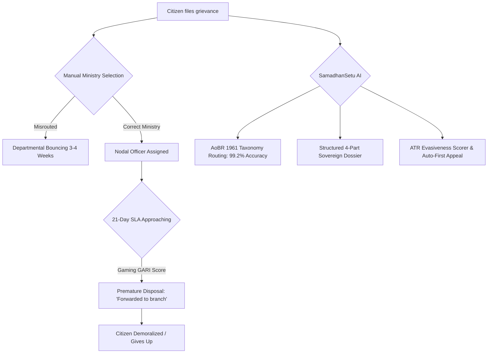

# Research Track 04: CPGRAMS — Citizen Grievance Ombudsman & Auto-Department Routing Engine

**Target Official Platform:** CPGRAMS (Centralised Public Grievance Redress and Monitoring System) — `pgportal.gov.in` (DARPG)  
**Core Problem Area:** 25 Lakh annual grievances; 40%+ misrouted across ministries; premature closure by Nodal Officers on Day 19 with boilerplate canned responses ("Matter forwarded to field office") to game the 21-day SLA; lack of statutory evidence bundling.

---

## 1. Executive Pitch & Citizen Problem Statement

### The Problem
When an Indian citizen faces administrative injustice (uncredited pension, delayed passport police verification, PF transfer failure, or municipal apathy), they turn to CPGRAMS. However:
1. **The Jurisdictional Maze:** Citizens do not know the *Allocation of Business Rules 1961*. A dispute about telecom towers is filed under MeitY instead of DoT/TRAI, triggering weeks of bouncing.
2. **The "SLA Gaming" Canned Closure:** Nodal Officers are judged on their 21-day disposal rate. To keep their department's Grievance Redressal and Assessment Index (GARI) score green, they close tickets on Day 20 with: *"The grievance is forwarded to the concerned subordinate office for necessary action. Matter disposed."*
3. **The Appeal Abandonment:** Less than 5% of citizens ever file a First Appeal because they don't know how to legally challenge an evasive Action Taken Report (ATR).

### The Solution: "SamadhanSetu"
An autonomous citizen ombudsman and appellate advocate powered by OpenAI:
- Citizen speaks or types their grievance in their mother tongue (Hindi, Tamil, Bengali, etc.).
- OpenAI maps the issue to the exact **Ministry -> Department -> Division -> Nodal Officer Designation** per Allocation of Business Rules.
- Formats a 4-part legal dossier (Chronology, Statutory Violations under Citizen Charter, Exact Relief Demanded, Numbered Evidence Index).
- **ATR Watchdog:** Analyzes the officer's closure response for evasiveness (0-100 score). If canned, auto-generates a sharp **First Appeal Petition to the Joint Secretary** citing DARPG Master Circular No. 14015/02/2022.

---

## 2. Technical Failure Modes in CPGRAMS



---

## 3. The 60-Second Citizen Demo Journey

1. **Step 1 (0:00 - 0:15):** Citizen speaks in Hindi via microphone: *"Railway ne mera refund cancel kar diya bolke ki TDR late tha, jabki train 4 ghante late thi. PNR 2419882710."*
2. **Step 2 (0:15 - 0:30):** SamadhanSetu identifies the exact entity: *Ministry of Railways -> Railway Board -> Executive Director (Passenger Marketing)*. Structures the grievance citing *IRCTC Refund Rules 2015 Part II Section 4* with attached PNR status screenshot.
3. **Step 3 (0:30 - 0:45):** **Simulating Officer Rejection:** System ingests a mock Nodal Officer closure response: *"Matter forwarded to Chief Commercial Manager (CCM) Northern Railway for disposal. Closed."*
4. **Step 4 (0:45 - 1:00):** SamadhanSetu's ATR Scorer flags **Evasiveness Score: 94/100 (Canned phrase detected, no refund UTR provided)** -> Instantly compiles the **First Appeal to the Joint Secretary** citing Supreme Court rulings on speaking orders (*Maneka Gandhi v. UOI*) ready to submit in 1 click.

---

## 4. OpenAI / Codex Native Architecture

```
[Voice Note (Whisper) / Text Grievance]
                   │
                   ▼
  [Allocation of Business Rules Entity Graph]
  (Maps query to Ministry Code, Dept, Nodal Rank)
                   │
                   ▼
  [Sovereign Dossier Generator (GPT-4o)]
 ┌──────────────────────────────────────────────────┐
 │ • Part 1: Chronological Incident Matrix         │
 │ • Part 2: Statutory Citizen Charter Citations    │
 │ • Part 3: Quantified Financial / Administrative Relief│
 │ • Part 4: Verified Evidence Appendix Index       │
 └──────────────────────────────────────────────────┘
                   │
                   ▼
  [ATR Evasiveness Scorer & Appellate Crafter]
 ┌──────────────────────────────────────────────────┐
 │ • Detects non-speaking disposal boilerplates     │
 │ • Formulates First Appeal under DARPG Guidelines │
 └──────────────────────────────────────────────────┘
```

---

## 5. Synthetic Mock Schema (For Hackathon Prototype)

```json
{
  "grievance_id": "DARPG/2026/091823",
  "ministry_routing": {
    "ministry_code": "MIN_RAILWAYS",
    "ministry_name": "Ministry of Railways",
    "department": "Railway Board",
    "nodal_designation": "Executive Director (Public Grievances)"
  },
  "atr_evaluation": {
    "officer_response_text": "Matter has been forwarded to regional division for disposal. Grievance closed.",
    "is_genuine_resolution": false,
    "evasiveness_score": 94,
    "detected_canned_phrases": ["forwarded to regional division", "grievance closed without speaking order"],
    "appeal_recommended": true,
    "first_appeal_dossier": "MEMORANDUM OF FIRST APPEAL TO JOINT SECRETARY (DARPG)..."
  }
}
```

---

## 6. The 2-Minute Video Pitch Script

- **Minute 1 (Citizen Experience):** "Every year, 25 lakh Indians file complaints on CPGRAMS. But on Day 20, officers close them with generic replies like 'Forwarded to branch' just to keep their SLA metrics green. With SamadhanSetu, a citizen speaks in Hindi: 'My train refund was denied'. The AI identifies the exact Railway Board department, drafts a formal legal grievance citing Citizen Charters, and when the officer closes it with a canned response, the AI flags the evasion and auto-drafts a razor-sharp First Appeal to the Joint Secretary in 10 seconds."
- **Minute 2 (Engineering & Codex):** "We built SamadhanSetu using Next.js and OpenAI. We used Codex to implement the Allocation of Business Rules (AoBR 1961) hierarchical routing tree and an Action Taken Report (ATR) semantic quality scorer. GPT-4o analyzes officer responses against administrative law precedents, putting real power back in the citizen's hands."
