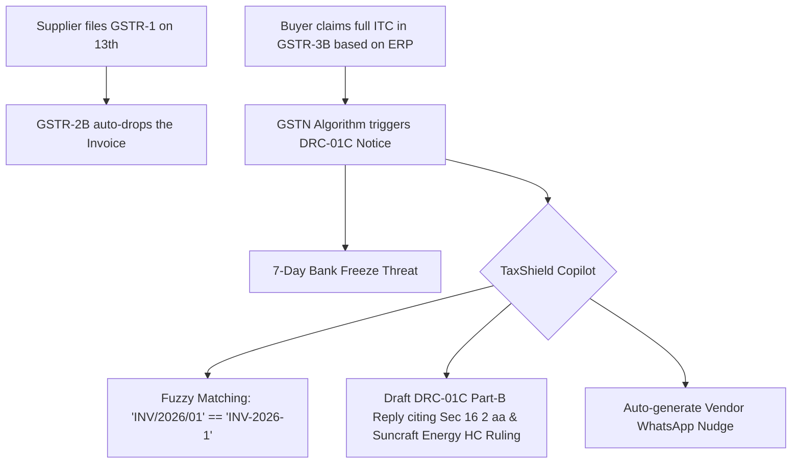

# Research Track 05: GST Portal — MSME Input Tax Credit (ITC) Reconciler & Notice Responder

**Target Official Platform:** Goods and Services Tax Network (GSTN) — `gst.gov.in`  
**Core Problem Area:** 1.4 crore registered taxpayers; GSTR-1 vs 2B vs 3B input tax credit mismatch; automated DRC-01B / DRC-01C notices; Rule 37 (180-day vendor payment reversal) and Rule 37A (supplier non-filing); truck driver midnight E-Way Bill breakdown panic.

---

## 1. Executive Pitch & Citizen Problem Statement

### The Problem
Indian MSMEs lose an estimated **₹1.5 Lakh Crore annually in blocked working capital** and litigation penalties due to uncoordinated vendor filings:
1. **The ITC Cut-Off Trap:** If a supplier uploads invoices on the 13th (instead of 11th), the buyer's auto-generated GSTR-2B drops the credit. When the buyer claims it in GSTR-3B based on their purchase register, GSTN automatically issues a **DRC-01C (Rule 88D) Notice** threatening bank account freezing within 7 days.
2. **Rule 37 & 37A Reversals:** If a supplier is unpaid after 180 days, or a vendor fails to file GSTR-3B by November 30, the buyer must reverse the full ITC plus **18% per annum compounding interest** u/s 50. Small businesses have zero automated aging trackers.
3. **The Midnight Trucker Crisis:** E-Way Bills expire at midnight. If a truck breaks down on NH-44, non-English speaking drivers cannot update Part-B on the complex web portal, risking a **200% vehicle seizure penalty** under Section 129.

### The Solution: "TaxShield & Sarathi Voice"
An autonomous GST intelligence suite and multilingual voice assistant powered by OpenAI:
- **For MSMEs:** Uploads Tally purchase register XLS + GSTR-2B JSON -> Reconciles invoices in seconds with fuzzy matching, calculates exact Rule 37/37A reversals with 18% interest, auto-generates DRC-01B/C replies citing Calcutta HC case law (*Suncraft Energy*), and sends automated WhatsApp payment nudges to defaulting vendors.
- **For Truckers ("Sarathi"):** Driver sends a voice note on WhatsApp in Hindi/Punjabi (*"Nagpur bypass pe gadi kharab hui, nayi gadi MH31 AB..."*) -> OpenAI Whisper + GPT-4o extracts the E-Way Bill, updates Part-B via mock NIC API, and sends back an audio confirmation and QR pass.

---

## 2. Technical Failure Modes in GST Ecosystem



---

## 3. The 60-Second Citizen Demo Journey

1. **Step 1 (0:00 - 0:15):** MSME owner (Ramesh, Surat Auto-Parts) uploads his Tally Purchase Register and a scanned DRC-01C tax demand notice of ₹4,80,000.
2. **Step 2 (0:15 - 0:30):** TaxShield analyzes 450 invoices in 3 seconds:
   - *Finding 1:* ₹3,10,000 discrepancy is from Vendor 'Apex Steels' who filed GSTR-1 two days late (eligible in next cycle).
   - *Finding 2:* ₹1,20,000 belongs to an unpaid vendor crossing 195 days (Rule 37 violation) -> calculates exact interest = ₹3,550.
   - *Finding 3:* ₹50,000 belongs to a vendor who filed GSTR-1 but didn't file GSTR-3B (Rule 37A).
3. **Step 3 (0:30 - 0:45):** TaxShield auto-generates the formal **DRC-01C Part-B response letter**, the challan payment breakup for Rule 37 interest, and formatted WhatsApp payment reminder templates for defaulting suppliers.
4. **Step 4 (0:45 - 1:00):** **Trucker Voice Demo:** Voice note played: *"Gadi kharab hui, nayi gadi MH31 AB 1234"* -> Sarathi Voice updates E-Way Bill Part-B in 2 seconds and speaks back in Hindi.

---

## 4. OpenAI / Codex Native Architecture

```
[Purchase Register XLS + GSTR-2B JSON + Notice PDF]
                         │
                         ▼
  [Multimodal Ingestion & Table Normalization]
  (Fuzzy string matcher for invoice numbering anomalies)
                         │
                         ▼
  [GST Statutory Rules Engine (Codex)]
 ┌──────────────────────────────────────────────────┐
 │ • CGST Act 2017 (Sec 16(2), 16(4), 17(5), 50)    │
 │ • Rule 37 (180-day tracker & 18% p.a. interest)  │
 │ • High Court Precedents (Suncraft Energy, Airtel)│
 └──────────────────────────────────────────────────┘
                         │
                         ▼
  [Structured Output & Action Artifacts]
 ┌──────────────────────────────────────────────────┐
 │ • drc01c_response_pdf: "Formal ASMT-11 Draft"    │
 │ • vendor_whatsapp_nudges: [ {...} ]              │
 │ • trucker_voice_part_b_payload: {...}            │
 └──────────────────────────────────────────────────┘
```

---

## 5. Synthetic Mock Schema (For Hackathon Prototype)

```json
{
  "gstin": "24ABCDE1234F1Z5",
  "tax_period": "JUL-2026",
  "drc01c_analysis": {
    "total_itc_claimed_3b": 1240000,
    "total_itc_available_2b": 760000,
    "net_discrepancy": 480000,
    "breakdown": [
      {
        "vendor_gstin": "27AAACG1122D1Z1",
        "vendor_name": "Apex Steels Pvt Ltd",
        "amount": 310000,
        "reason": "FILED_AFTER_CUTOFF",
        "legal_defense": "ITC eligible under Section 16(2)(aa); vendor filed GSTR-1 on 13th."
      },
      {
        "vendor_gstin": "24BBBCK9988E1Z3",
        "vendor_name": "Zenith Logistics",
        "amount": 120000,
        "reason": "RULE_37_180_DAYS_OVERDUE",
        "interest_liability_sec_50": 3550,
        "action": "REVERSE_AND_PAY_INTEREST"
      }
    ]
  }
}
```

---

## 6. The 2-Minute Video Pitch Script

- **Minute 1 (Citizen Experience):** "Meet Ramesh, an SME trader in Surat. He receives a ₹4.8 Lakh DRC-01C tax demand notice from the government giving him 7 days before his bank account is frozen. He has no idea why. He uploads his Tally spreadsheet and the notice to TaxShield. In 3 seconds, TaxShield matches 450 invoices, proves that ₹3.1 Lakh was just a supplier filing 2 days late, computes the exact ₹3,550 interest for Rule 37, auto-drafts the official response for the tax officer, and sends automated WhatsApp payment reminders to his vendors."
- **Minute 2 (Engineering & Codex):** "We used Codex to build our high-performance fuzzy invoice reconciliation engine and statutory rule-calculators. OpenAI GPT-4o powers both the legal defense generator and our voice-first 'Sarathi' assistant on WhatsApp, allowing truck drivers to update expiring E-Way bills using pure regional voice notes during midnight breakdowns."
