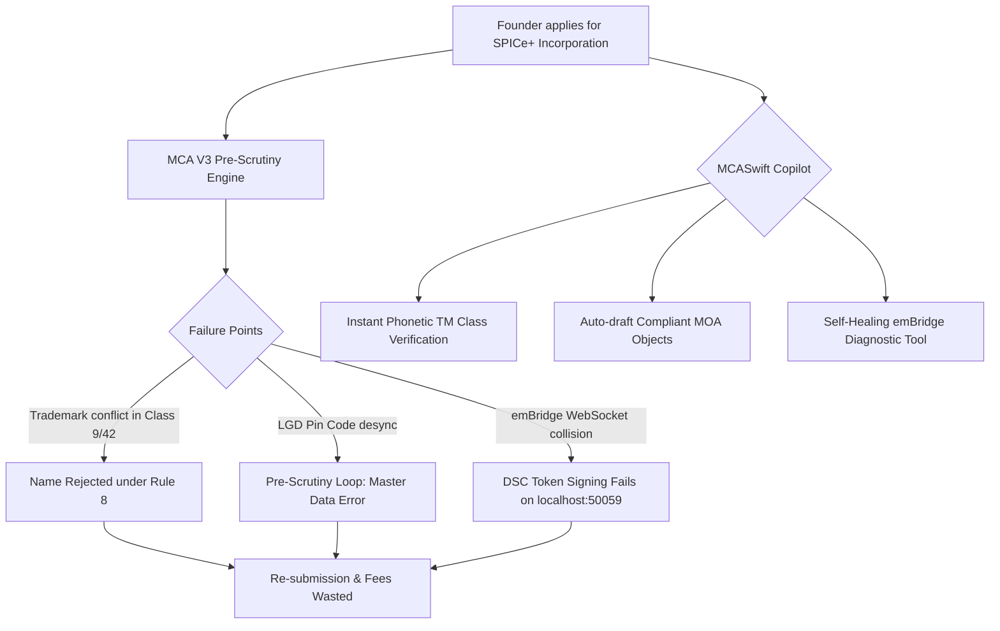

# Research Track 06: MCA21 — SPICe+ Pre-Flight Incorporation Checker & Glitch Resolver

**Target Official Platform:** Ministry of Corporate Affairs (MCA21 V3) — `mca.gov.in`  
**Core Problem Area:** 40%+ re-submission rate for SPICe+ (INC-32) company incorporations, RUN name rejection due to vague trademark conflicts under Rule 8, LGD pin-code validation loops, emBridge PKCS#11 USB DSC driver crashes, and DIR-3 KYC deactivations.

---

## 1. Executive Pitch & Citizen Problem Statement

### The Problem
Starting a business in India should take 24 hours. Instead, entrepreneurs and Company Secretaries face an exhausting maze on MCA21 V3:
1. **Name Reservation & Trademark Class 9/42 Traps:** A founder files a company name ("NexGen Cloud Technologies"), pays ₹1,000, and is rejected after 5 days because of a phonetically similar dormant trademark in Class 42.
2. **The LGD (Local Government Directory) Pin-Code Loop:** If a registered office PIN code does not match the exact Census village/district spelling in the government's LGD database, the SPICe+ form crashes during pre-scrutiny with an unhelpful error: *"Error in Master Data Validation"*.
3. **The emBridge / PKCS#11 DSC Nightmare:** Digital signature tokens fail because emBridge WebSocket port `127.0.0.1:50059` crashes or fails role-mapping on macOS/Windows 11, stranding users at the final step.

### The Solution: "MCASwift"
An AI-powered pre-flight incorporation suite and emBridge diagnostic copilot:
- Entrepreneur inputs business intent in plain English: *"I want to build a B2B SaaS platform for drone deliveries in Maharashtra."*
- OpenAI conducts an instant pre-filing Trademark phonetics scan across all IP India classes, drafts compliant **MOA/AOA Main Objects clauses** under Companies (Incorporation) Rules 2014, validates director KYC credentials, auto-maps LGD pin codes, and diagnoses local emBridge DSC port conflicts with self-healing scripts.

---

## 2. Technical Failure Modes in MCA21 V3



---

## 3. The 60-Second Citizen Demo Journey

1. **Step 1 (0:00 - 0:15):** Founder types: *"Incorporating 'SkyVolt Aero Pvt Ltd' for drone mapping software in Pune."*
2. **Step 2 (0:15 - 0:30):** MCASwift runs pre-flight audit in 2 seconds:
   - *Trademark Risk:* Flags a conflicting registered mark "SkyVolt Electronics" in Class 9; recommends *"SkyVolt AeroSpatial Software"* with 98% clearance probability.
   - *LGD Mapping:* Resolves PIN `411045` to exact Census Village *Baner, Haveli Taluk* avoiding the master data lock.
3. **Step 3 (0:30 - 0:45):** Auto-generates the complete **MOA Object Clause III(A)** legally compliant with Table A of Companies Act 2013 and pre-populates AGILE-PRO-S (EPFO/ESIC/GST/Bank Account) fields.
4. **Step 4 (0:45 - 1:00):** **emBridge Diagnostic Widget:** System detects a localhost port conflict (`50059` blocked by local proxy) -> Generates a 1-click PowerShell fix, connects the USB DSC token, and generates the validated SPICe+ JSON ready for upload.

---

## 4. OpenAI / Codex Native Architecture

```
[Natural Language Business Intent + Founder ID]
                       │
                       ▼
    [MCA Pre-Flight Compiler (GPT-4o + Codex)]
 ┌──────────────────────────────────────────────────┐
 │ • IP India Trademark Phonetic Matcher            │
 │ • Companies (Incorporation) Rules 2014 Validator │
 │ • Table A MOA/AOA Legal Clause Generator         │
 │ • LGD Census PIN Code Directory Mapping          │
 └──────────────────────────────────────────────────┘
                       │
                       ▼
  [emBridge Health Sentinel (Local WebSocket Client)]
 ┌──────────────────────────────────────────────────┐
 │ • Detects USB PKCS#11 token driver status        │
 │ • Diagnoses port 50059 / 60000 collisions        │
 └──────────────────────────────────────────────────┘
                       │
                       ▼
 [Validated SPICe+ INC-32 JSON + MOA/AOA PDF Pack]
```

---

## 5. Synthetic Mock Schema (For Hackathon Prototype)

```json
{
  "proposed_name": "SkyVolt AeroSpatial Software Pvt Ltd",
  "business_activity_code": "6201 - Computer programming & software",
  "pre_flight_audit": {
    "trademark_clearance": {
      "status": "APPROVED",
      "class_checked": [9, 42],
      "phonetic_similarity_score": 0.08
    },
    "lgd_mapping": {
      "pincode": "411045",
      "state_code": "27 (Maharashtra)",
      "district_lgd_code": "489 (Pune)",
      "sub_district": "Haveli",
      "village_census_code": "556102"
    },
    "moa_objects_clause": "To carry on the business of software development, artificial intelligence analytics, and autonomous geospatial mapping platforms for unmanned aerial vehicles...",
    "spice_plus_json_ready": true
  }
}
```

---

## 6. The 2-Minute Video Pitch Script

- **Minute 1 (Citizen Experience):** "Starting a company in India should be as fast as registering a domain. Instead, 40% of founders get rejected because of obscure trademark classes, local government directory pin code errors, or emBridge digital signature crashes. Meet MCASwift. A founder describes their business in one sentence. In 3 seconds, MCASwift checks trademark phonetics, auto-drafts the legal MOA clauses, maps the exact government census codes, and fixes local USB token errors, creating a 100% rejection-proof incorporation file."
- **Minute 2 (Engineering & Codex):** "We used Codex to build the SPICe+ schema validator and our emBridge diagnostic tool. GPT-4o synthesizes statutory MOA/AOA clauses compliant with Companies Act 2013 Table A. All backend state transitions are simulated with realistic Indian corporate filings, turning days of CA back-and-forth into a 60-second wizard."
