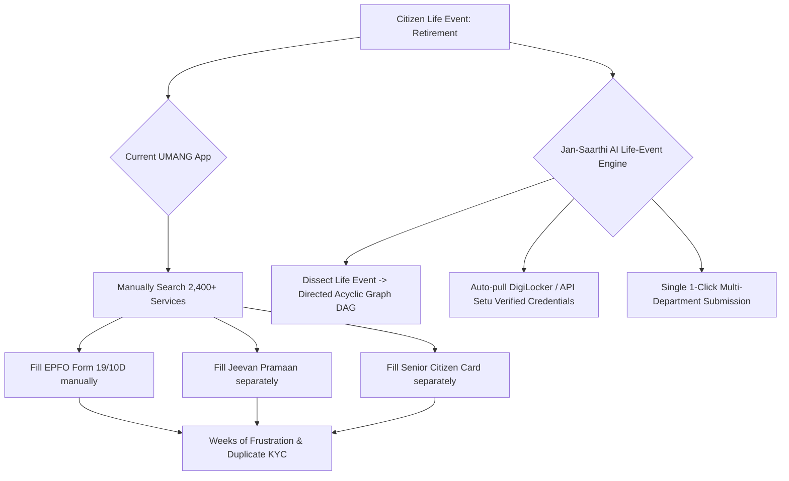

# Research Track 08: UMANG — Proactive Citizen Life-Event Service Orchestrator

**Target Official Platform:** UMANG (Unified Mobile Application for New-age Governance) — `web.umang.gov.in` (NeGD / MeitY)  
**Core Problem Area:** Cluttered catalog of 2,400+ services; broken webview iFrames; keyword search failures; redundant manual re-entry of KYC across departments; zero proactive life-event chaining.

---

## 1. Executive Pitch & Citizen Problem Statement

### The Problem
UMANG promises a unified gateway to all government services. In reality:
1. **The "Dumpster Catalog" Syndrome:** Citizens face a wall of 2,400+ services organized by ministry acronyms (e.g. DoT, MoAFW, ESIC). Searching for *"PF balance"* or *"Birth certificate"* fails if the state calls it *"e-District Janam Pramaan Patra"*.
2. **The Re-KYC Penalty:** Despite having Aadhaar and DigiLocker, every single department form on UMANG forces citizens to repeatedly re-enter their Name, Father's Name, DOB, Address, Bank Account, and upload manual document scans.
3. **The Siloed Experience:** When a citizen experiences a major life event (e.g., birth of a child, retirement, job loss, buying a house), they must discover and fill out 6 to 8 disconnected government portals over several months.

### The Solution: "Jan-Saarthi AI"
An intelligent, proactive life-event service orchestrator powered by OpenAI:
- Citizen speaks or types a single life event: *"My father retired last week from a private firm in Pune. How do we settle his PF, pension, and get his senior citizen health card?"*
- OpenAI dissects the query into a **Directed Acyclic Graph (DAG)** of government services across EPFO, Jeevan Pramaan, and Ayushman Bharat.
- Connects mock DigiLocker / API Setu credentials to **auto-fill 90% of form fields**, chaining multi-department applications into a single 1-click execution pipeline.

---

## 2. Technical Failure Modes in UMANG



---

## 3. The 60-Second Citizen Demo Journey

1. **Step 1 (0:00 - 0:15):** Citizen types or speaks: *"I just had a baby girl in rural Maharashtra. What government schemes and documents should I get?"*
2. **Step 2 (0:15 - 0:30):** Jan-Saarthi AI's Life-Event Planner analyzes national and state welfare databases in 2 seconds, constructing a personalized **4-Step Execution Pipeline**:
   - *Step 1:* Birth Registration & Baal Aadhaar (e-District Maharashtra).
   - *Step 2:* Sukanya Samriddhi Yojana Account (Department of Posts).
   - *Step 3:* PMMVY (Pradhan Mantri Matru Vandana Yojana) Maternity Benefit of ₹5,000.
   - *Step 4:* Ayushman Bharat PM-JAY Child Health Enrollment.
3. **Step 3 (0:30 - 0:45):** Citizen clicks **"Connect DigiLocker"** -> System pulls verified parent Aadhaar and hospital birth intimation, auto-populating 100% of common identity and bank details.
4. **Step 4 (0:45 - 1:00):** Citizen reviews the unified application summary and clicks **"Submit Unified Life-Event Dossier"** -> Generates simulated API submissions to all 4 departments simultaneously.

---

## 4. OpenAI / Codex Native Architecture

```
[Citizen Natural Language Query / Voice Input]
                       │
                       ▼
    [Life-Event Intent & Semantic Parser (GPT-4o)]
  (Maps life events: Birth, Marriage, Retirement, Job Loss)
                       │
                       ▼
      [API Setu & Service DAG Orchestrator (Codex)]
 ┌──────────────────────────────────────────────────┐
 │ • Evaluates Central + State Scheme Eligibility   │
 │ • Compiles Directed Acyclic Graph (DAG) of Forms │
 └──────────────────────────────────────────────────┘
                       │
                       ▼
     [Universal Zero-Entry Schema Auto-Filler]
 ┌──────────────────────────────────────────────────┐
 │ • Maps DigiLocker XML attributes to target APIs  │
 │ • Eliminates 90% manual typing across schemas   │
 └──────────────────────────────────────────────────┘
```

---

## 5. Synthetic Mock Schema (For Hackathon Prototype)

```json
{
  "life_event_id": "LIFE-EVENT-BIRTH-2026-09",
  "citizen_event": "NEWBORN_FEMALE_CHILD",
  "state": "Maharashtra",
  "orchestrated_services": [
    {
      "step": 1,
      "service_name": "Baal Aadhaar & Birth Certificate",
      "department": "UIDAI & Maharashtra e-District",
      "status": "READY_TO_SUBMIT",
      "auto_filled_fields": ["parent_aadhaar", "dob", "gender", "address"]
    },
    {
      "step": 2,
      "service_name": "Sukanya Samriddhi Yojana (SSY)",
      "department": "India Post / Ministry of Finance",
      "status": "ELIGIBLE_SAVINGS_8_2_PERCENT",
      "auto_filled_fields": ["child_name", "guardian_pan", "bank_ifsc"]
    },
    {
      "step": 3,
      "service_name": "PMMVY Maternity Benefit (₹5,000 DBT)",
      "department": "Ministry of Women & Child Development",
      "status": "FIRST_CHILD_ELIGIBLE"
    }
  ]
}
```

---

## 6. The 2-Minute Video Pitch Script

- **Minute 1 (Citizen Experience):** "UMANG has over 2,400 services, but when you have a baby, you have to find and fill 5 different portals, typing your Aadhaar, bank details, and address every single time. With Jan-Saarthi AI, a parent says: 'I just had a baby girl in Maharashtra'. The AI instantly maps every scheme they qualify for — from Baal Aadhaar to Sukanya Samriddhi Yojana and ₹5,000 maternity DBT — auto-pulls their verified DigiLocker data, and completes all 4 government applications in a single 60-second flow."
- **Minute 2 (Engineering & Codex):** "We used Codex to engineer our semantic Life-Event DAG planner and the universal API Setu schema auto-filler. OpenAI GPT-4o decomposes complex citizen queries into structured, executable multi-department dependency graphs. The prototype connects to mock DigiLocker credentials, turning a fragmented 3-month administrative ordeal into a seamless, proactive citizen journey."
