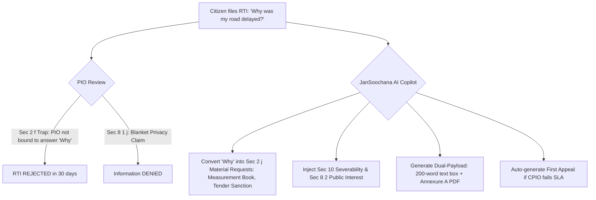

# Research Track 10: RTI Online — Bulletproof Query & First Appeal Architect

**Target Official Platform:** RTI Online (Department of Personnel and Training - DoPT) — `rtionline.gov.in`  
**Core Problem Area:** 68%+ RTI rejection rate due to informal "Why/How" drafting falling into Section 2(f) traps; weaponization of Section 8(1)(j) and 8(1)(d) exemptions by Public Information Officers (PIOs); 500-word character limits; Section 6(3) transfer black holes.

---

## 1. Executive Pitch & Citizen Problem Statement

### The Problem
The Right to Information (RTI) Act 2005 is India's most powerful citizen accountability tool. Yet over **68% of citizen RTIs fail**:
1. **The "Why" Question Trap (Section 2(f)):** Citizens ask conversational questions: *"Why was my colony road repair delayed for 2 years? Who is the corrupt engineer?"* PIOs immediately reject this citing the Supreme Court *Aditya Bandopadhyay* precedent (*"PIO is not required to answer 'Why' or create opinions"*).
2. **Section 8 Exemption Weaponization:** PIOs routinely deny public contracts or official records claiming "Commercial Confidence" (8(1)(d)) or "Personal Privacy" (8(1)(j)), ignoring Section 10 severability rules.
3. **The 500-Word Limitation:** The portal's 3,000-character text box limits citizens from structuring comprehensive multi-part queries.

### The Solution: "JanSoochana Copilot / RTI-Sarthi"
An autonomous transparency agent powered by OpenAI:
- Citizen expresses what happened in plain voice or text: *"The drainage repair in our colony failed in the first rain. I want to know who was paid and why."*
- OpenAI converts emotional grievances into **strict Section 2(j) material record requests** (Measurement Books, Third-Party Quality Test Reports, Running Account Bills, File Notings).
- Injects pre-emptive legal defenses (**Section 10 Severability** & **Section 8(2) Public Interest Override**) to strip PIOs of boilerplate excuses.
- **Dual-Payload Architecture:** Auto-compiles a tight 200-word portal summary + a compressed, legally formatted Annexure A PDF.
- If rejected, auto-drafts a razor-sharp **Section 19(1) First Appeal** citing Central Information Commission (CIC) case law.

---

## 2. Technical Failure Modes in RTI Online



---

## 3. The 60-Second Citizen Demo Journey

1. **Step 1 (0:00 - 0:15):** Citizen (Priya, Pune) uploads a scanned PIO rejection order where her municipal drainage inquiry was dismissed under Section 8(1)(d).
2. **Step 2 (0:15 - 0:30):** JanSoochana AI parses the rejection in 3 seconds, detecting that the PIO failed to apply Section 10 severability and violated CVC circulars regarding public contract transparency.
3. **Step 3 (0:30 - 0:45):** In 1 click, the system auto-generates:
   - A formal **Section 19(1) First Appeal Petition** citing *Association for Democratic Reforms (2002)* and demanding penalties u/s 20(1).
   - A fresh, unassailable **Section 2(j) RTI Query** targeting the exact Measurement Books (MB) and Quality Test Vouchers.
4. **Step 4 (0:45 - 1:00):** Priya reviews the formatted legal dossier with automated Public Authority routing (Pune Municipal Corporation -> Chief Engineer Drains) ready to submit.

---

## 4. OpenAI / Codex Native Architecture

```
[Citizen Natural Language Voice / Text + Rejection PDF]
                           │
                           ▼
     [Section 2(f) Material Transformer (GPT-4o)]
  (Converts questions into requests for physical/digital records)
                           │
                           ▼
     [Public Authority Knowledge Graph (Codex)]
 ┌──────────────────────────────────────────────────┐
 │ • Maps 4,200+ Central & State Authorities        │
 │ • Eliminates Section 6(3) transfer black holes   │
 └──────────────────────────────────────────────────┘
                           │
                           ▼
   [Exemption Pre-Emption & Dual-Payload Formatter]
 ┌──────────────────────────────────────────────────┐
 │ • Portal Text Box Payload (< 250 words)          │
 │ • Structured Annexure A PDF (with Sec 10 clause) │
 │ • First Appeal & Section 20 Penalty Drafter      │
 └──────────────────────────────────────────────────┘
```

---

## 5. Synthetic Mock Schema (For Hackathon Prototype)

```json
{
  "rti_application_id": "RTI-DOPT-2026-99120",
  "target_public_authority": "Pune Municipal Corporation (PMC)",
  "cpio_jurisdiction": "Executive Engineer (Drainage & Civil Works)",
  "payload": {
    "portal_text_box_content": "Request for Information under Section 6(1) and Section 2(j) of the RTI Act 2005. Please provide certified true copies of the material records specified in the attached self-attested Annexure A regarding Tender Work No: PMC/DRAIN/2024-25/112. Section 10 severability applies...",
    "annexure_a_items": [
      "Certified copy of Final Measurement Book (MB No. 412/A)",
      "Certified copy of Quality Inspection & Compaction Test Reports",
      "Certified copy of Itemized Running Account (RA) Bills & Final Vouchers"
    ],
    "first_appeal_dossier_ready": true
  }
}
```

---

## 6. The 2-Minute Video Pitch Script

- **Minute 1 (Citizen Experience):** "The RTI Act is supposed to give power to ordinary Indians, but 68% of applications get rejected because citizens ask 'Why did the road fail?' and PIOs reject it using technical loopholes. Meet JanSoochana AI. A citizen explains their problem in plain language. The AI transforms it into a precision-engineered legal request for specific measurement books and tender vouchers, injects statutory privacy severability clauses, and produces an airtight application that PIOs cannot legally refuse."
- **Minute 2 (Engineering & Codex):** "We used Codex to build our hierarchical Public Authority knowledge graph and the dual-payload compressor that bypasses the portal's 500-word limit. OpenAI GPT-4o synthesizes statutory RTI queries and First Appeal petitions grounded in Supreme Court and Central Information Commission rulings. It turns complex administrative law into a 60-second democratic weapon for every Indian."
