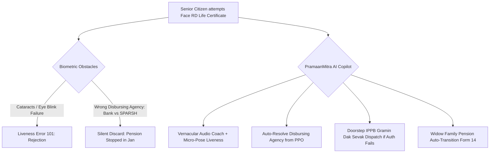

# Research Track 11: Pension / Jeevan Pramaan — Senior Citizen DLC & Family Pension Transition Companion

**Target Public Infrastructure:** Jeevan Pramaan (DLC) / SPARSH (Defence Accounts) / CPENGRAMS / DoPPW  
**Core Problem Area:** 1 crore+ pensioners; super-seniors (80+) failing Face RD / fingerprint authentication due to cataracts, tremors, and skin atrophy; grieving elderly widows facing a 3–9 month pension stoppage after pensioner death; missing OROP arrears on SPARSH.

---

## 1. Executive Pitch & Citizen Problem Statement

### The Problem
Every November, 1 crore+ Indian pensioners face the anxiety of submitting their Annual Digital Life Certificate (DLC):
1. **The Biometric Failure Trap:** The Aadhaar Face RD mobile app requires 4–5 continuous eye blinks in an elliptical circle. Super-seniors with mature cataracts, glaucoma, or Parkinson's tremors fail authentication repeatedly (`Error 101: Liveness Failed`).
2. **The Disbursing Agency (PDA) Error:** Pensioners migrated to SPARSH select "State Bank of India" as their disburser instead of "PCDA Allahabad", causing their DLC to be silently discarded.
3. **The Bereavement Hiatus for Widows:** When a pensioner passes away, the bank account is frozen. Surviving elderly widows (often non-digitally literate) face a 3-to-9 month financial blackout navigating Form 14, un-endorsed PPOs, and missing lifetime arrears (LTA).

### The Solution: "PramaanMitra & SPARSH-Saarthi"
A voice-first, empathetic pension companion powered by OpenAI:
- **For DLC:** Provides real-time vernacular audio coaching in 14 languages (*"Maaji, camera thoda upar kijiye, roshni kam hai"*), uses micro-pose liveness for cataract-affected seniors, and auto-detects the exact Disbursing Agency from the PPO number.
- **For Bereaved Widows:** Grandson or widow inputs the death certificate and PPO -> AI auto-fills **Form 14**, calculates **OROP-2/3 revised family pension and arrears**, and dispatches the transition dossier to PCDA/CPPC with 1 click.

---

## 2. Technical Failure Modes in Pension Systems



---

## 3. The 60-Second Citizen Demo Journey

1. **Step 1 (0:00 - 0:15):** Smt. Pushpa Devi (76, Rohtak), widow of a retired Subedar, attempts her Life Certificate.
2. **Step 2 (0:15 - 0:30):** PramaanMitra speaks in gentle Haryanvi/Hindi voice: guides her grandson to hold the camera steady, adjusts lighting, and successfully generates **Pramaan ID #8849-2026-9921**.
3. **Step 3 (0:30 - 0:45):** **Proactive SPARSH Forensic Audit:** The AI detects that her late husband's PPO was migrated to SPARSH, but her family pension was disbursed at outdated 2018 rates. It detects **₹1,41,000 in unpaid OROP-2 arrears**.
4. **Step 4 (0:45 - 1:00):** System auto-generates **Form 14 Joint Endorsement**, attaches the verified digital death certificate via DigiLocker, and dispatches the claim directly to PCDA Prayagraj and CPENGRAMS.

---

## 4. OpenAI / Codex Native Architecture

```
[Voice Guidance Loop (IndicWhisper/TTS) + Video Stream]
                           │
                           ▼
     [Pre-Flight Environmental & Pose Engine (Codex)]
 ┌──────────────────────────────────────────────────┐
 │ • Real-time lux, tremor, and tilt compensator   │
 │ • Fallback micro-pose liveness for cataracts     │
 │ • PPO Disbursing Agency (PDA) Auto-Detector      │
 └──────────────────────────────────────────────────┘
                           │
                           ▼
     [SPARSH Forensic & Family Pension Transformer]
 ┌──────────────────────────────────────────────────┐
 │ • OROP-2/3 Pension Slab Recalculator             │
 │ • Form 14 Bereavement Transition Generator       │
 │ • Doorstep IPPB Postman Dispatch API Bridge      │
 └──────────────────────────────────────────────────┘
```

---

## 5. Synthetic Mock Schema (For Hackathon Prototype)

```json
{
  "ppo_number": "DPEN/2018/ROH/7721",
  "pensioner_name": "Late Subedar Ram Singh",
  "family_beneficiary": "Pushpa Devi (Spouse)",
  "dlc_status": {
    "pramaan_id": "8849-2026-9921",
    "pda_assigned": "PCDA (P) SPARSH - Defence",
    "verification_modality": "FACE_RD_MICRO_POSE"
  },
  "forensic_audit": {
    "entitled_monthly_pension": 23450,
    "current_disbursed_pension": 18750,
    "unpaid_orop_arrears_inr": 141000,
    "form_14_dossier_ready": true
  }
}
```

---

## 6. The 2-Minute Video Pitch Script

- **Minute 1 (Citizen Experience):** "Every year, millions of elderly Indian pensioners with cataracts and hand tremors fail the mobile Face Life Certificate and have their pensions frozen. Meet PramaanMitra. It coaches the senior with gentle voice notes in their own dialect, verifies their life certificate using micro-pose liveness, and auto-detects that this widow was underpaid ₹1.41 Lakh in military pension arrears. In 1 click, it files Form 14 and claims her rightful lifetime savings."
- **Minute 2 (Engineering & Codex):** "We used Codex to build our pre-flight biometric camera stabilizer and the OROP-2 pension revision calculation engine. OpenAI powers the empathetic vernacular conversational assistant and the automated PCDA legal petition compiler, ensuring that no Indian senior citizen is left behind by digital bureaucracy."
