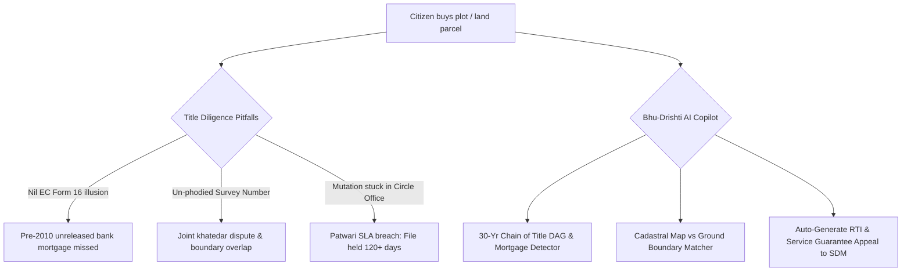

# Research Track 12: Land Records — 7/12 Title & Mutation Risk Analyzer

**Target State Portals:** Bhoomi / Kaveri 2.0 (Karnataka), Dharani (Telangana), Bhulekh (UP), Banglarbhumi (West Bengal), Mahabhulekh (Maharashtra)  
**Core Problem Area:** 66%+ of civil litigation in India stems from land disputes; presumptive title traps; Nil Encumbrance Certificate (EC Form 16) illusions hiding unreleased bank mortgages; un-phodied joint survey numbers; mutation files stuck in Circle Offices for months without formal reason.

---

## 1. Executive Pitch & Citizen Problem Statement

### The Problem
Land represents 73% of Indian household wealth, but buying land is a legal minefield:
1. **The Form 16 (Nil EC) Trap:** A buyer downloads an Encumbrance Certificate showing "Nil Encumbrance" for 2015–2026. They don't realize a 2008 registered mortgage in favor of a bank was never released, exposing them to bank auction.
2. **The Un-Phodied Parcel Conflict:** A farmer sells 1 acre out of 5 acres under Survey No. 42. The deed is registered, but without statutory sub-division (Phodi), the buyer is merely a joint khatedar. If another co-owner mortgages the whole 5 acres, the buyer is ruined.
3. **The Mutation Black Hole:** Registration at the Sub-Registrar Office (SRO) is NOT title transfer. Mutation in the Revenue Circle Office takes months, where Patwaris/Lekhpals hold files hostage with phantom objections.

### The Solution: "Bhu-Drishti / Bhu-Pramaan AI"
An autonomous title intelligence and mutation guardian powered by OpenAI:
- Citizen uploads land deeds, 7/12 extract / RTC, and EC PDF.
- OpenAI builds a **30-Year Chain-of-Title Directed Acyclic Graph (DAG)**, identifies missing heirs/unreleased mortgages/PTCL government land risks, and performs cadastral boundary verification.
- **Mutation Sentinel:** Tracks Circle Office SLA countdowns; if stalled past 30 days, auto-generates a **Section 6(1) RTI Application & State Service Guarantee Appeal** to the Sub-Divisional Magistrate (SDM).

---

## 2. Technical Failure Modes in Land Governance



---

## 3. The 60-Second Citizen Demo Journey

1. **Step 1 (0:00 - 0:15):** Citizen (Ramesh, Bengaluru) uploads a 2014 Sale Deed, RTC Pahani, and 2024 Nil EC for a 2-acre plot in Devanahalli (Survey No. 88/2).
2. **Step 2 (0:15 - 0:30):** Bhu-Drishti AI parses the deeds in 3 seconds and triggers 2 high-risk alerts:
   - *Alert 1 (Mortgage):* Nil EC only covered 2015–2026; Kaveri registry reveals a 2008 mortgage deed (Doc #4412/2008) in favor of Syndicate Bank that was never cancelled on record!
   - *Alert 2 (Buffer Zone):* 0.35 acres of the eastern boundary falls within the statutory 25m buffer of a primary canal (Rajakaluve).
3. **Step 3 (0:30 - 0:45):** **Rescuing a Stuck Mutation:** The seller's mutation application has been pending for 114 days at the Nadakacheri office.
4. **Step 4 (0:45 - 1:00):** System auto-generates an official **Sakala Service Guarantee Appeal (Section 9)** and a **Section 6(1) RTI petition to the Tahsildar** demanding the daily movement register of the file.

---

## 4. OpenAI / Codex Native Architecture

```
[Sale Deeds (PDF/Scan) + 7/12 Extract + EC Form 15/16]
                           │
                           ▼
     [Multilingual Land Deed OCR & Parser (GPT-4o)]
  (Extracts: Survey No, Extent, Mortgages, Boundary Schedule)
                           │
                           ▼
     [30-Year Title Lineage & DAG Engine (Codex)]
 ┌──────────────────────────────────────────────────┐
 │ • Reconstructs ownership chain from 1990–2026    │
 │ • Flags Section 22A / Inam / PTCL land risks     │
 │ • Compares Cadastral BhuNaksha vectors vs Deeds  │
 └──────────────────────────────────────────────────┘
                           │
                           ▼
     [Mutation Sentinel & Legal Appeal Generator]
 ┌──────────────────────────────────────────────────┐
 │ • Title Health Score Card & Risk Summary         │
 │ • Pre-filled RTI & Service Guarantee Appeal Pack │
 └──────────────────────────────────────────────────┘
```

---

## 5. Synthetic Mock Schema (For Hackathon Prototype)

```json
{
  "survey_number": "88/2",
  "village": "Devanahalli, Bengaluru Rural",
  "title_audit_result": {
    "title_health_score": "AMBER_HIGH_RISK",
    "critical_flags": [
      {
        "type": "UNRELEASED_MORTGAGE",
        "doc_number": "4412/2008",
        "mortgagee": "Syndicate Bank (now Canara Bank)",
        "amount_inr": 1500000,
        "recommendation": "Demand registered Deed of Reconveyance before purchase"
      },
      {
        "type": "ECOLOGICAL_BUFFER_ZONE",
        "description": "0.35 Acres falls within 25m Rajakaluve buffer zone"
      }
    ],
    "mutation_sentinel": {
      "mr_number": "T-2025-09881",
      "days_pending": 114,
      "statutory_sla_limit": 30,
      "auto_drafted_rti_ready": true
    }
  }
}
```

---

## 6. The 2-Minute Video Pitch Script

- **Minute 1 (Citizen Experience):** "66% of court cases in India are land disputes. People buy land thinking a 'Nil Encumbrance Certificate' means 100% clean title, only to find out years later that the bank has a 2008 mortgage or the seller's mutation was stuck. Meet Bhu-Drishti. In 3 seconds, it scans 30 years of deeds, uncovers hidden bank encumbrances, checks if the plot violates stormwater buffer zones, and auto-files an RTI to unblock stuck mutations in the local revenue office."
- **Minute 2 (Engineering & Codex):** "We used Codex to build our Title Lineage DAG engine and cadastral vector parser. OpenAI GPT-4o extracts structured property schedules from regional Indian land deeds and synthesizes formal legal appeals under state Right to Services laws. It democratizes legal due diligence for every land buyer in India."
