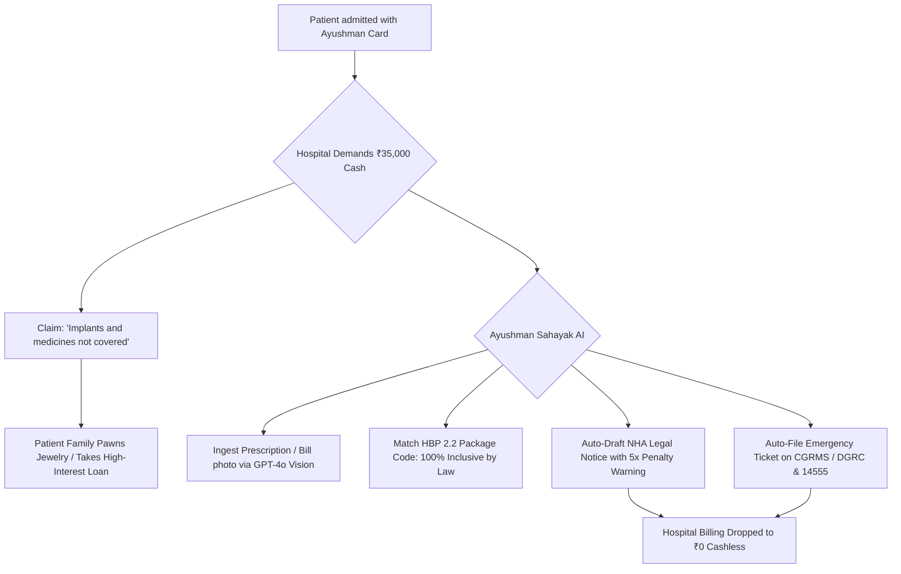

# Research Track 13: Ayushman Bharat (PM-JAY) — Cashless Pre-Auth Denial Advocate & Hospital Package Finder

**Target Public Infrastructure:** National Health Authority (NHA) / PM-JAY / TMS 2.0 / CGRMS / ABHA  
**Core Problem Area:** 55 crore eligible beneficiaries; poor families coerced into paying ₹25,000–₹50,000 in out-of-pocket cash by empanelled private hospitals claiming "implants and medicines not covered in Ayushman"; arbitrary pre-authorization rejections; lack of vernacular package transparency.

---

## 1. Executive Pitch & Citizen Problem Statement

### The Problem
Ayushman Bharat (PM-JAY) guarantees ₹5 Lakh/year of 100% cashless hospitalization for poor Indian families. In reality, at the hospital billing counter:
1. **The Out-of-Pocket Extortion Trap:** A poor patient arrives for gall bladder surgery or knee replacement with an active Golden Card. The hospital administrator demands ₹35,000 cash, claiming: *"The Ayushman package doesn't cover titanium implants, anesthesia, or 15 days recovery medicines."* Families pawn ancestral jewelry in desperation.
2. **The Truth under NHA Guidelines:** Under **HBP 2.2 / HBP 2022**, all 1,949+ packages are **100% cashless and all-inclusive** (pre-op tests 3 days prior, implants, OT, bed, food, and 15 days take-home medicines upon discharge). Overcharging carries a **5x-10x fine and de-empanelment**.
3. **The Silent Pre-Auth Rejection:** Private hospitals intentionally trigger pre-auth rejections by omitting mandatory diagnostic evidence (e.g. coronary angiogram) to convert patients into cash-paying customers.

### The Solution: "Ayushman Sahayak AI"
An instant WhatsApp & voice-first patient advocate powered by OpenAI:
- Patient or relative sends a voice note or snaps a photo of the handwritten hospital demand slip / prescription.
- OpenAI extracts the procedure and demanded amount, looks up the exact **HBP 2.2 Package Code (e.g. `OR002A` - Total Knee Replacement)**, and generates an official **"Hospital Legal Notice & Cashless Violation Summary"** citing NHA Guidelines Clause 5.2.
- Automatically files an emergency priority complaint on **CGRMS (`cgrms.pmjay.gov.in`)** and alerts the District Grievance Redressal Committee (DGRC) and 14555 Helpline.

---

## 2. Technical Failure Modes in PM-JAY



---

## 3. The 60-Second Citizen Demo Journey

1. **Step 1 (0:00 - 0:15):** Ramesh (Varanasi) is standing at the billing desk. Hospital is demanding ₹45,000 cash for his mother's Total Knee Replacement. He sends a voice note in Bhojpuri/Hindi on WhatsApp.
2. **Step 2 (0:15 - 0:30):** Ayushman Sahayak replies in calm Hindi audio: *"Ramesh ji, ₹1 bhi mat dijiye. HBP Package OR002A ke tahat knee implant aur 15 din ki dawai 100% cashless hai."*
3. **Step 3 (0:30 - 0:45):** Ramesh uploads a photo of the hospital's handwritten ₹45,000 demand slip.
4. **Step 4 (0:45 - 1:00):** **The Magic Moment:** In 3 seconds, the AI generates the formal **NHA Hospital Violation Notice PDF** and logs **CGRMS Case #AY-VAR-8921**. Ramesh shows the notice to the billing head -> Hospital immediately cancels the cash demand and provides 100% cashless discharge.

---

## 4. OpenAI / Codex Native Architecture

```
[Voice Note (IndicWhisper) / Hospital Bill Photo (Vision)]
                           │
                           ▼
      [NHA HBP 2.2 Master Ontology & Package Matcher]
  (Maps 1,949 surgical/medical codes, implants, and drugs)
                           │
                           ▼
      [Out-of-Pocket Extortion Detector (Codex)]
 ┌──────────────────────────────────────────────────┐
 │ • Checks mandatory statutory package inclusions │
 │ • NHA Empanelment Contract Penalties (Clause 5.2)│
 └──────────────────────────────────────────────────┘
                           │
                           ▼
      [Instant Legal Notice & CGRMS Dispatcher]
 ┌──────────────────────────────────────────────────┐
 │ • Hospital Management Legal Notice PDF           │
 │ • Priority DGRC / 14555 Grievance Payload        │
 └──────────────────────────────────────────────────┘
```

---

## 5. Synthetic Mock Schema (For Hackathon Prototype)

```json
{
  "hospital_name": "Shanti Multispeciality Hospital, Varanasi",
  "patient_pmjay_id": "PMJAY-UP-992100412",
  "package_audit": {
    "hbp_code": "OR002A",
    "procedure_name": "Total Knee Arthroplasty (Unilateral)",
    "package_rate_inr": 105000,
    "cashless_inclusions": [
      "Titanium/Cobalt-Chromium Knee Implant (NPPA capped)",
      "Anesthesia & Pre-op Diagnostics (3 days prior)",
      "ICU, Nursing & Surgeon Fees",
      "15 Days Take-Home Post-Discharge Medicines"
    ],
    "illegal_cash_demanded": 45000,
    "violation_severity": "CRITICAL_STATUTORY_BREACH",
    "cgrms_case_id": "CGRMS/2026/UP/091823"
  }
}
```

---

## 6. The 2-Minute Video Pitch Script

- **Minute 1 (Citizen Experience):** "Ayushman Bharat gives 55 crore poor Indians ₹5 Lakh in free healthcare. But when they reach private hospitals, administrators illegally demand ₹45,000 cash for implants and medicines. Meet Ayushman Sahayak. A distressed son sends a voice note and a photo of the hospital's demand slip. In 3 seconds, OpenAI identifies the exact government package code, proves that the implant and medicines are 100% cashless by law, auto-drafts an official legal warning to the hospital CEO, and files a priority case with the District Magistrate. The hospital drops the bill to zero."
- **Minute 2 (Engineering & Codex):** "We used Codex to structure our NHA Health Benefit Package database (1,949 clinical procedures) and the automated CGRMS grievance dispatcher. OpenAI GPT-4o Vision parses messy handwritten hospital bills and matches them against statutory healthcare entitlements in real time. It is a live shield against medical bankruptcy for millions of vulnerable Indian families."
