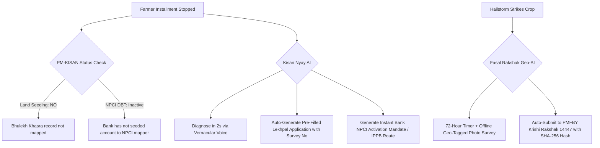

# Research Track 14: PM-KISAN & e-NAM — Farmer Entitlement Doctor & 72-Hour Crop Loss Evidence Locker

**Target Public Infrastructure:** PM-KISAN (`pmkisan.gov.in`) / e-NAM / PMFBY (`pmfby.gov.in` / Krishi Rakshak 14447) / Agmarknet  
**Core Problem Area:** 2 crore+ farmers facing stopped ₹2,000 PM-KISAN installments due to `Land Seeding: NO` and `NPCI DBT inactive` flags; Mandi price exploitation by village middlemen; PMFBY crop insurance claims rejected due to failure to report localized hailstorm/flood damage within the mandatory 72-hour window.

---

## 1. Executive Pitch & Citizen Problem Statement

### The Problem
Indian farmers face three continuous operational chokepoints:
1. **The Silent PM-KISAN Stop:** A smallholder stops receiving their ₹2,000 installment. The portal says `Land Seeding: NO` or `Aadhaar-Bank Mismatch`. The farmer makes multiple trips to the Tehsil without knowing whether their Lekhpal or their Bank Manager needs to fix it.
2. **Mandi Price Asymmetry:** Smallholders sell soybean or wheat to village middlemen at ₹500/quintal below APMC modal rates because they lack real-time vernacular price intelligence comparing nearby mandis factoring in transport costs.
3. **The 72-Hour Crop Insurance Trap:** When a midnight hailstorm flattens a crop, PMFBY rules mandate that the farmer **MUST intimate the loss within 72 hours** with geo-tagged photos. Rural farmers miss this deadline or lack internet, resulting in 100% claim rejection.

### The Solution: "Kisan Nyay & Fasal Rakshak AI"
A vernacular voice-first agriculture co-pilot powered by OpenAI:
- **For PM-KISAN:** Farmer speaks their Aadhaar/Mobile in Hindi/Marathi/Telugu -> AI diagnoses the exact root cause (`Land Seeding: NO` vs `NPCI Inactive`), and auto-fills a localized **Lekhpal Rectification Application** or bank DBT mandate.
- **For Mandi Price:** Calculates net farmer realization across 5 nearby APMCs accounting for tractor diesel costs.
- **For Crop Loss (PMFBY):** Offline-first guided camera assistant walks the farmer through a 4-step photo survey with GPS/compass metadata, generating a cryptographic timestamped claim ticket to Helpline 14447 within the 72-hour window.

---

## 2. Technical Failure Modes in Agri-DPI



---

## 3. The 60-Second Citizen Demo Journey

1. **Step 1 (0:00 - 0:15):** Suresh Patel (Raisen, MP) calls the voice bot in Hindi: *"Meri pichli 3 kistein nahi aayi, ₹6,000 ruka hua hai."*
2. **Step 2 (0:15 - 0:30):** Kisan Nyay AI queries the database in 2 seconds:
   - *Issue 1:* `Land Seeding: NO` on MP Bhulekh Khasra 214/1 due to a 1-character surname typo.
   - *Issue 2:* `NPCI DBT: INACTIVE` at SBI branch.
3. **Step 3 (0:30 - 0:45):** In 1 click, system generates:
   - Pre-filled **Lekhpal Land Verification Form** for Tehsil Raisen.
   - 1-Click advice to open an India Post Payments Bank (IPPB) account which activates NPCI DBT in 24 hours.
4. **Step 4 (0:45 - 1:00):** **Crop Loss 72-Hour Demo:** Farmer snaps 2 photos of hailed onion crop -> Fasal Rakshak stamps GPS coords + timestamp + SHA-256 hash -> Generates verified **PMFBY Claim Token #PMFBY-MH-2026-78190**.

---

## 4. OpenAI / Codex Native Architecture

```
[Vernacular Voice Stream (IndicWhisper) + Farm Photos]
                           │
                           ▼
      [PM-KISAN & Bhulekh Diagnostic Engine (Codex)]
 ┌──────────────────────────────────────────────────┐
 │ • Scans Land Seeding, e-KYC, and NPCI status     │
 │ • Agmarknet 2.0 Real-time Mandi Price Engine     │
 └──────────────────────────────────────────────────┘
                           │
                           ▼
      [PMFBY 72-Hour Geo-Forensic Vault (GPT-4o)]
 ┌──────────────────────────────────────────────────┐
 │ • EXIF GPS & Satellite Timestamp Validator       │
 │ • Computer Vision Crop Damage Estimator          │
 │ • Auto-Dispatcher to Krishi Rakshak Portal 14447 │
 └──────────────────────────────────────────────────┘
```

---

## 5. Synthetic Mock Schema (For Hackathon Prototype)

```json
{
  "farmer_aadhaar": "XXXX-XXXX-9812",
  "name": "Suresh Kumar Patel",
  "state": "Madhya Pradesh",
  "pm_kisan_diagnostic": {
    "total_dues_pending_inr": 6000,
    "issues": [
      {
        "type": "LAND_SEEDING_NO",
        "khasra_no": "214/1",
        "tehsil": "Raisen",
        "action_required": "Submit pre-filled Form to Lekhpal"
      },
      {
        "type": "NPCI_DBT_INACTIVE",
        "bank_name": "State Bank of India",
        "workaround": "Open instant IPPB account for 24-hr auto-seeding"
      }
    ]
  },
  "pmfby_crop_claim": {
    "claim_token": "PMFBY-MP-2026-99120",
    "calamity_type": "HAILSTORM_LOCALIZED",
    "hours_remaining_in_72hr_window": 64,
    "verified_damage_percentage": 82
  }
}
```

---

## 6. The 2-Minute Video Pitch Script

- **Minute 1 (Citizen Experience):** "2 crore Indian farmers have their ₹2,000 welfare payments blocked because of cryptic flags like 'Land Seeding: NO' or 'NPCI Inactive'. And when hailstorms destroy their crops, they lose insurance payouts because they miss the strict 72-hour reporting window. Meet Kisan Nyay. A farmer speaks in Hindi: 'My payments stopped'. The AI pinpoints the exact land revenue typo, generates their revenue form, and when a storm hits, it guides them through an offline photo survey that locks in their insurance claim within the 72-hour deadline."
- **Minute 2 (Engineering & Codex):** "We engineered Kisan Nyay using Next.js and OpenAI. We used Codex to implement the Agmarknet spatial price optimizer and the EXIF geo-tagging validation pipeline. OpenAI GPT-4o powers the conversational vernacular voice assistant and computer vision damage estimator, protecting farmer livelihoods across India."
