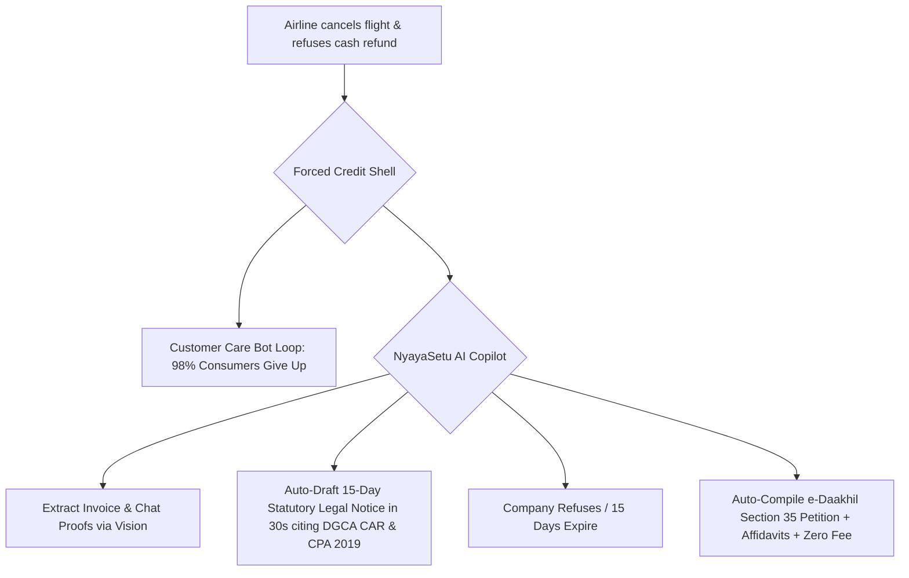

# Research Track 15: Consumer Helpline (NCH) — 30-Second Legal Notice & e-Daakhil Filer

**Target Public Infrastructure:** National Consumer Helpline (NCH / INGRAM 1915) / e-Daakhil / e-Jagriti (Department of Consumer Affairs)  
**Core Problem Area:** E-commerce, airline, and banking refund refusals (e.g. forced credit shells, damaged goods); corporate customer care attrition; cost of hiring a lawyer (₹10,000+) exceeding the disputed amount (₹4,000); complex Consumer Commission filing rules.

---

## 1. Executive Pitch & Citizen Problem Statement

### The Problem
When an airline or e-commerce giant refuses a ₹5,000 refund, they exploit a massive cost asymmetry:
1. **The Corporate Attrition Game:** Corporations use chatbot loops and template rejections, knowing that 98% of consumers will give up because hiring an advocate to draft a legal notice costs ₹10,000–₹15,000.
2. **The Legal Notice Necessity:** Under the **Consumer Protection Act 2019 (CPA 2019)**, a formal 15-day Statutory Legal Notice is the essential trigger that establishes cause of action and pushes companies to settle under NCH convergence.
3. **The e-Daakhil Hurdle:** Filing before the District Consumer Commission on `edaakhil.nic.in` requires formal memo of parties, verification affidavits, and jurisdiction calculations that ordinary consumers cannot draft alone.

### The Solution: "NyayaSetu Consumer Advocate"
An autonomous legal notice engine and e-Daakhil court filer powered by OpenAI:
- Consumer uploads screenshots of chat/invoice and transaction proofs.
- OpenAI extracts dates, PNR/Order ID, amount paid, and maps violations under CPA 2019 (Sec 2(47) Unfair Trade Practice, Sec 2(11) Deficiency in Service) and DGCA/RBI Master Directions.
- **30-Second Legal Notice:** Auto-generates a formal 15-Day Statutory Legal Notice demanding full refund + 18% p.a. interest + compensation.
- **Auto-Escalation to e-Daakhil:** If unpaid after 15 days, auto-compiles the complete **Section 35 Consumer Complaint Petition**, index, and sworn verification affidavit with **₹0 court fees** (for claims up to ₹5 Lakhs).

---

## 2. Technical Failure Modes in Consumer Redressal



---

## 3. The 60-Second Citizen Demo Journey

1. **Step 1 (0:00 - 0:15):** Citizen (Rohit, Bengaluru) uploads a ticket PDF and chat screenshot where an airline cancelled his ₹8,200 flight and forced an expiring credit shell.
2. **Step 2 (0:15 - 0:30):** NyayaSetu AI parses the breach in 2.8 seconds:
   - *Statutory Breach:* DGCA Civil Aviation Requirements (CAR) Series M Part IV & CPA 2019 Section 2(47) Unfair Trade Practice.
   - *Mandatory Remedy:* Full Cash Refund to source within 7 days.
3. **Step 3 (0:30 - 0:45):** **30-Second Output:** Generates the formal **Statutory Legal Notice PDF** addressed to the airline CEO and Grievance Officer demanding ₹8,200 + 18% interest + ₹10,000 compensation within 15 days.
4. **Step 4 (0:45 - 1:00):** **Fast-Forward 15 Days (e-Daakhil Escalation):** System auto-compiles the complete **Section 35 Consumer Complaint Dossier** for Bengaluru Urban District Commission (Pecuniary limit verified, court fee = ₹0.00) ready to e-file.

---

## 4. OpenAI / Codex Native Architecture

```
[Dispute Screenshots / Ticket PDF / Bank Statement]
                         │
                         ▼
     [Dispute Extraction & Entity Graph (GPT-4o)]
  (Extracts: PNR, UTR, Amount Paid, Incident Dates, Merchant)
                         │
                         ▼
     [CPA 2019 & Sectoral Rules Engine (Codex)]
 ┌──────────────────────────────────────────────────┐
 │ • CPA 2019 Sections (Sec 2(47), 2(11), 35, 34(2))│
 │ • DGCA CAR / RBI Zero Liability Circulars        │
 │ • Pecuniary & Territorial Jurisdiction Matcher   │
 └──────────────────────────────────────────────────┘
                         │
                         ▼
     [30-Sec Legal Notice & e-Daakhil Docket Forge]
 ┌──────────────────────────────────────────────────┐
 │ • Formal 15-Day Legal Demand Notice PDF          │
 │ • Form 1 Memo of Parties & Petition Narrative    │
 │ • Sworn Verification Affidavit for Notary        │
 └──────────────────────────────────────────────────┘
```

---

## 5. Synthetic Mock Schema (For Hackathon Prototype)

```json
{
  "complaint_id": "CPA-2026-BLR-00912",
  "dispute_type": "AIRLINE_FORCED_CREDIT_SHELL",
  "disputed_amount_inr": 8200,
  "opposite_party": "InterGlobe Aviation Ltd (IndiGo)",
  "statutory_violations": [
    "DGCA CAR Section 3 Series M Part IV (Clause 3.3.2)",
    "Section 2(47) Consumer Protection Act 2019 (Unfair Trade Practice)",
    "Section 2(11) CPA 2019 (Deficiency in Service)"
  ],
  "jurisdiction_audit": {
    "forum": "District Consumer Disputes Redressal Commission (Bangalore Urban)",
    "pecuniary_jurisdiction_valid": true,
    "territorial_basis": "Complainant Residence (Sec 34(2)(d))",
    "statutory_court_fee_inr": 0
  },
  "generated_artifacts": {
    "legal_notice_pdf": true,
    "edaakhil_petition_packet": true,
    "sworn_affidavit_ready": true
  }
}
```

---

## 6. The 2-Minute Video Pitch Script

- **Minute 1 (Citizen Experience):** "When an airline cancels your flight and gives you an expiring credit shell instead of your ₹8,200 cash, they know you won't spend ₹10,000 on a lawyer. Meet NyayaSetu. You upload your ticket and chat screenshot. In 3 seconds, OpenAI analyzes the law, drafts a formal 15-day statutory legal notice with Supreme Court citations, and if they still don't pay, compiles your entire Consumer Court lawsuit with zero court fees in 1 click."
- **Minute 2 (Engineering & Codex):** "We used Codex to implement our statutory jurisdiction calculator and court fee optimization engine under the Consumer Protection Rules 2021. OpenAI GPT-4o extracts chronological dispute timelines from unstructured chat transcripts and synthesizes court-compliant pleadings. We have leveled the playing field between ordinary Indian consumers and billion-dollar corporations."
