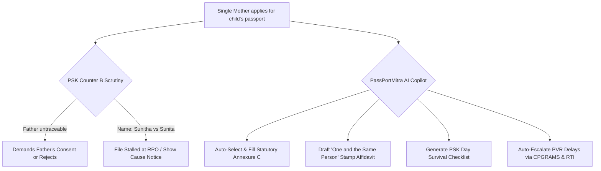

# Research Track 16: Passport Seva — Document Validator & Police Verification Fast-Track Assistant

**Target Official Platform:** Passport Seva (Ministry of External Affairs - MEA) — `passportindia.gov.in` / mPassport  
**Core Problem Area:** Rejections at PSK Counters A/B/C due to single-parent consent (Annexure C vs D); minor spelling differences between Birth Certificate, 10th marksheet, and Aadhaar; Police Verification Report (PVR) delays exceeding 14 days at local Thanas without tracking.

---

## 1. Executive Pitch & Citizen Problem Statement

### The Problem
Getting a passport is often a citizen's first encounter with strict sovereign verification:
1. **The Single-Parent Gridlock:** Single mothers, separated spouses, or guardians applying for a minor child's passport are turned away at PSK Counter B because of confusion between Annexure C (single parent without father's consent) and Annexure D (consenting both parents), or demands for nonexistent court orders.
2. **Spelling Inconsistencies:** Minor phonetic variations (`Sunitha` vs `Sunita`) between maternal birth certificates and 10th marksheets cause officer objections, driving citizens to touts charging ₹5,000–₹10,000.
3. **The Police Verification (PVR) Black Hole:** Over 30% of passport delays stem from files stalled at local police stations for weeks with zero digital visibility for the applicant.

### The Solution: "PassPortMitra"
An autonomous passport document audit and verification navigator powered by OpenAI:
- Citizen enters their family situation and uploads supporting IDs.
- OpenAI scans documents, predicts officer objections at Counter A/B/C, auto-selects and fills the exact statutory **Annexure (C/D/E/F)**, and drafts a **"One and the Same Person" Notarized Stamp Affidavit** for minor phonetic mismatches.
- **PVR Watchdog:** If police verification exceeds the 14-day SLA, auto-generates 1-click escalation petitions across CPGRAMS, MEA Twitter Seva, and Section 6(1) RTI queries.

---

## 2. Technical Failure Modes in Passport Seva



---

## 3. The 60-Second Citizen Demo Journey

1. **Step 1 (0:00 - 0:15):** Citizen (Sunita Nair, single mother, Kochi) inputs: *"Applying for my 9yo daughter Ananya. Father deserted family 4 years ago. Mother's name on Birth Cert is 'Sunitha R. Nair', but Passport says 'Sunita Nair'."*
2. **Step 2 (0:15 - 0:30):** PassPortMitra audits the case in 3 seconds:
   - *Parental Consent:* Detects that father is untraceable -> Selects **Statutory Annexure C** (Declaration for single parent without father's consent).
   - *Name Variation:* Classifies `Sunitha` vs `Sunita` as a *Minor Phonetic Discrepancy*.
3. **Step 3 (0:30 - 0:45):** In 1 click, system generates:
   - Official **Annexure C Declaration** ready to sign.
   - Legal **"One and the Same Person" Affidavit** on ₹100 stamp paper format.
4. **Step 4 (0:45 - 1:00):** System produces the **PSK Counter Walkthrough Checklist** (Folder 1: Originals, Folder 2: Self-attested copies, Counter-A TCS data entry instructions).

---

## 4. OpenAI / Codex Native Architecture

```
[Citizen Family Context + Uploaded IDs (Birth Cert, Aadhaar)]
                             │
                             ▼
      [Document Cross-Validation & Fuzzy Matcher (GPT-4o)]
  (Evaluates String Distance & MEA Passport Rules Matrix)
                             │
                             ▼
      [Annexure & Affidavit Synthesis Engine (Codex)]
 ┌──────────────────────────────────────────────────┐
 │ • Passports Act 1967 (Sec 6(2) Exemption Rules)  │
 │ • Annexure C / D / E / F Form Generator          │
 │ • "One & Same Person" Notarized Stamp Formatter  │
 └──────────────────────────────────────────────────┘
                             │
                             ▼
      [PVR SLA Tracker & Escalation Bridge]
 ┌──────────────────────────────────────────────────┐
 │ • Detects Thana delays > 14 days                 │
 │ • Auto-drafts CPGRAMS & MEA Twitter Seva Petitions│
 └──────────────────────────────────────────────────┘
```

---

## 5. Synthetic Mock Schema (For Hackathon Prototype)

```json
{
  "applicant_type": "MINOR_CHILD",
  "child_name": "Ananya Nair",
  "guardian": "Sunita Nair (Mother)",
  "compliance_audit": {
    "parental_consent_pathway": "ANNEXURE_C_SINGLE_PARENT",
    "name_discrepancy": {
      "birth_cert_name": "Sunitha R. Nair",
      "passport_name": "Sunita Nair",
      "severity": "MINOR_PHONETIC",
      "solution": "One and the Same Person Notarized Affidavit"
    },
    "artifacts_generated": {
      "annexure_c_pdf": true,
      "affidavit_stamp_draft": true,
      "psk_counter_guide": true
    }
  }
}
```

---

## 6. The 2-Minute Video Pitch Script

- **Minute 1 (Citizen Experience):** "Getting a passport for a child with a single mother or a minor spelling difference in a birth certificate usually ends in rejection at Counter B or paying ₹10,000 to agents. Meet PassPortMitra. A single mother enters her situation. In 3 seconds, OpenAI identifies that she qualifies under Statutory Annexure C, auto-drafts her Notarized 'One and the Same Person' affidavit, and creates an exact Counter-by-Counter folder checklist that guarantees 100% PSK clearance on day one."
- **Minute 2 (Engineering & Codex):** "We used Codex to build our MEA Passport Manual rules engine and the PVR police verification SLA monitor. OpenAI GPT-4o parses multi-document identity variations and generates statutory affidavits compliant with Indian Notaries Act standards, eliminating middlemen and bureaucracy."
