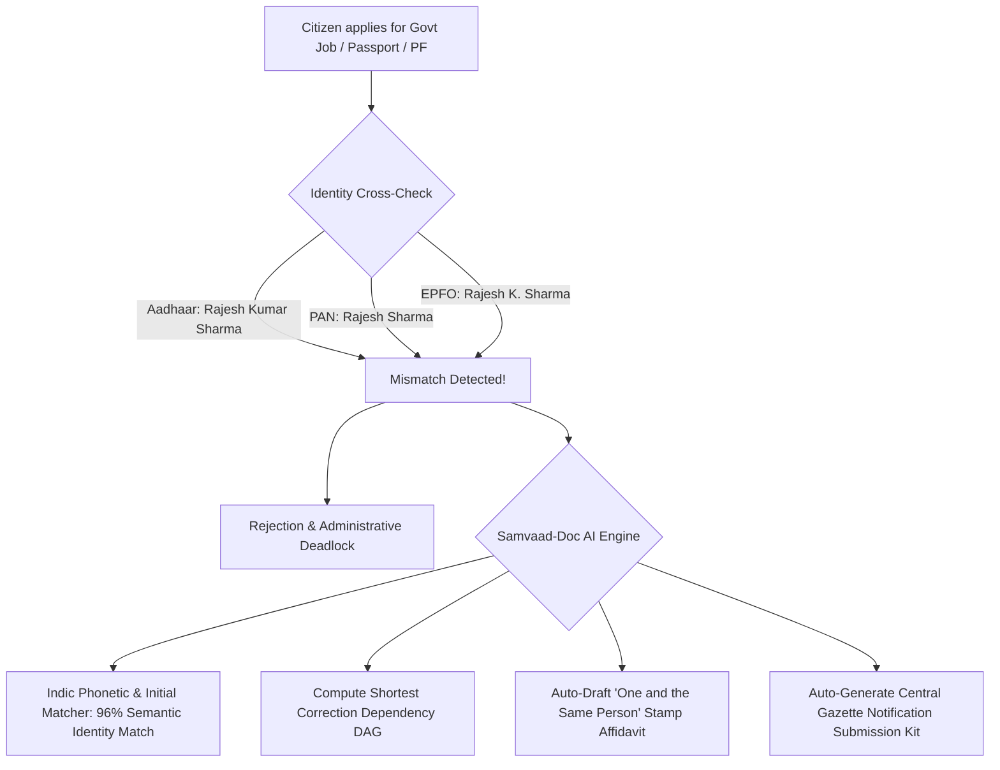

# Research Track 17: DigiLocker — Multi-Document Identity Mismatch & Self-Affidavit Reconciler

**Target Public Infrastructure:** DigiLocker / UIDAI (Aadhaar) / NSDL (PAN) / State Education Boards / Parivahan  
**Core Problem Area:** 100M+ citizens blocked from government jobs (UPSC/SSC), college admissions, property purchases, bank KYC, and passport issuance due to minor transliteration / initial / DOB discrepancies across their identity stack; circular dependency deadlock (fixing PAN requires fixing Aadhaar, which requires 10th marksheet).

---

## 1. Executive Pitch & Citizen Problem Statement

### The Problem
Almost every Indian citizen has minor spelling or format discrepancies across their documents:
- **Aadhaar:** `Rajesh Kumar Sharma`, DOB: `1972` (Year only).
- **PAN Card:** `Rajesh Sharma`, Father: `Om Prakash Sharma`.
- **10th Marksheet:** `Rajesh Kumar Sharma`, DOB: `12/04/1972`.
- **EPFO UAN:** `Rajesh K. Sharma`, Father: `O. P. Sharma`.
- **The Deadlock:** A single initial or missing middle name triggers rejection in government recruitments (UPSC, SSC, Railway RRB), bank account opening (PMLA rules), or PF withdrawals. Fixing them manually creates a circular dependency nightmare where each agency asks for the other's updated ID.

### The Solution: "Samvaad-Doc Reconciler"
An autonomous identity graph reconciler and legal affidavit engine powered by OpenAI:
- Citizen connects mock DigiLocker or uploads 3 IDs (Aadhaar, PAN, Marksheet).
- OpenAI compares phonetic character matrices across all documents using **Indic Soundex & Expandable Initial Matching (EIM)**.
- Computes the **Shortest Correction Dependency DAG** (e.g., Update Aadhaar DOB first using 10th marksheet, then sync PAN).
- Auto-generates the legally binding **"One and the Same Person" Notarized Affidavit**, the **Central Gazette Notification Submission Kit**, and the **EPFO Joint Declaration SOP 3.0 Packet**.

---

## 2. Technical Failure Modes in Document Identity



---

## 3. The 60-Second Citizen Demo Journey

1. **Step 1 (0:00 - 0:15):** Citizen (Rajesh, 54, Kanpur) connects mock DigiLocker. System loads his Aadhaar, PAN, 10th Marksheet, and EPFO profile.
2. **Step 2 (0:15 - 0:30):** Samvaad-Doc displays a visual **Discrepancy Matrix** in 2 seconds:
   - *Conflict 1:* Aadhaar has Year-only DOB (`1972`) vs Marksheet full date (`12/04/1972`).
   - *Conflict 2:* PAN is missing middle name "Kumar".
   - *Conflict 3:* EPFO profile has initials "K." and father initial "O.P.".
3. **Step 3 (0:30 - 0:45):** **The Solution DAG:** In 1 click, system generates:
   - Step 1: 1-click Aadhaar DOB correction payload using 10th marksheet.
   - Step 2: Pre-filled **EPFO Joint Declaration SOP 3.0 Dossier**.
   - Step 3: Legally binding **"One and the Same Person" Notarized Affidavit** on ₹10 stamp paper layout.
4. **Step 4 (0:45 - 1:00):** System packages the **Central Gazette Notification Kit** (Affidavit + Classified Ad text + BharatKosh challan payload) ready to publish.

---

## 4. OpenAI / Codex Native Architecture

```
[DigiLocker Verified Credentials (XML / JSON / OCR)]
                          │
                          ▼
     [Indic Phonetic & Initial Matcher (Codex)]
  (Indic Double Metaphone + Expandable Initial Resolution EIM)
                          │
                          ▼
     [Cross-Document Dependency DAG Engine (Codex)]
 ┌──────────────────────────────────────────────────┐
 │ • Identifies statutory Anchor Document           │
 │ • Computes shortest correction graph             │
 └──────────────────────────────────────────────────┘
                          │
                          ▼
     [Automated Legal Artifact Generator (GPT-4o)]
 ┌──────────────────────────────────────────────────┐
 │ • 'One and the Same Person' Notarized Affidavit  │
 │ • Central Gazette Notification Application Pack  │
 │ • SOP 3.0 Joint Declaration PDF                  │
 └──────────────────────────────────────────────────┘
```

---

## 5. Synthetic Mock Schema (For Hackathon Prototype)

```json
{
  "citizen_id": "RECON-2026-KANPUR-0012",
  "name_variants": {
    "aadhaar": "Rajesh Kumar Sharma",
    "pan": "Rajesh Sharma",
    "marksheet_10th": "Rajesh Kumar Sharma",
    "epfo_uan": "Rajesh K Sharma"
  },
  "dob_variants": {
    "aadhaar": "1972",
    "marksheet_10th": "1972-04-12"
  },
  "reconciliation_result": {
    "semantic_match_confidence": 0.96,
    "shortest_correction_path": [
      "Step 1: Sync Aadhaar DOB with 10th Marksheet",
      "Step 2: Submit SOP 3.0 Joint Declaration to EPFO",
      "Step 3: Notarize One-and-Same-Person Affidavit for Bank KYC"
    ],
    "artifacts_generated": {
      "one_and_same_affidavit_ready": true,
      "gazette_kit_ready": true,
      "epfo_joint_declaration_ready": true
    }
  }
}
```

---

## 6. The 2-Minute Video Pitch Script

- **Minute 1 (Citizen Experience):** "In India, almost every citizen has a slight name mismatch between Aadhaar, PAN, and their 10th marksheet. An initial like 'K.' or missing middle name can block your pension, passport, or government job. Meet Samvaad-Doc. A citizen connects DigiLocker. In 3 seconds, OpenAI maps all name variations, proves with 96% confidence that they are the same individual, calculates the shortest legal fix, and auto-drafts a notarized 'One and the Same Person' affidavit and Gazette packet ready to print."
- **Minute 2 (Engineering & Codex):** "We used Codex to engineer our Indic phonetic transliteration graph and the cross-document correction DAG. OpenAI GPT-4o synthesizes standardized legal affidavits compliant with the Indian Notaries Act and Department of Publication gazette standards. This is the universal identity reconciler for 1.4 billion Indians."
