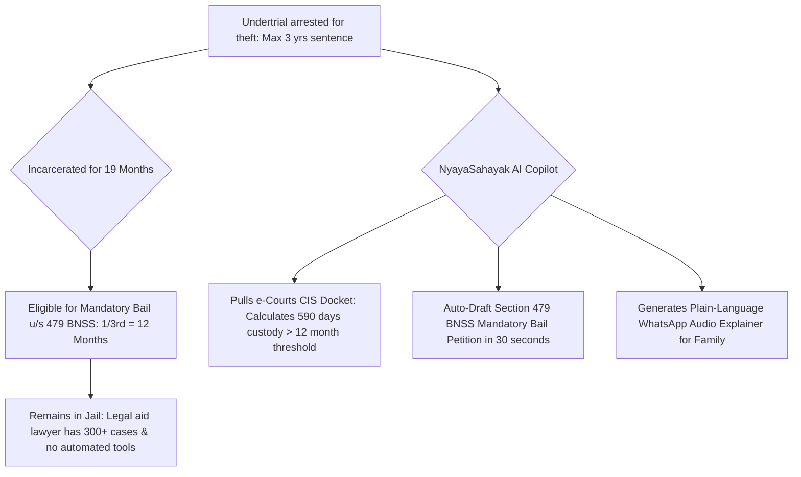

# Research Track 18: e-Courts & Tele-Law — Plain-Language Case Tracker & Section 479 BNSS Bail Draftsman

**Target Public Infrastructure:** e-Courts Services (`ecourts.gov.in`) / Tele-Law (Department of Justice) / NALSA / NJDG  
**Core Problem Area:** 4.5 crore pending court cases; 75%+ prison population are undertrials; legal aid lawyers lacking automated petition tools under the new **Section 479 Bharatiya Nagarik Suraksha Sanhita (BNSS), 2023** (1/3rd detention mandatory bail for first-time offenders); non-lawyer citizens terrified by scanned court orders full of archaic Latin/legal jargon.

---

## 1. Executive Pitch & Citizen Problem Statement

### The Problem
Indian legal proceedings are an opaque maze for ordinary litigants:
1. **The Undertrial Tragedy:** Over 75% of Indian prison inmates are undertrials. Under Section 479 of the new **BNSS 2023** (affirmed by the Supreme Court in 2024), first-time offenders **MUST be released on bail** after serving 1/3rd of the maximum sentence. Yet over 150,000 eligible undertrials remain trapped in jail because overworked legal aid lawyers lack tools to calculate custody periods and file bail petitions.
2. **The Archaic Legalese Barrier:** A rural mother checks e-Courts for her son's case and reads: *"Ld. APP present. Accused from JC. Steps not taken for PW-3. PF/RC not filed. Issue NBW returnable by 14.10. Put up for PE."* She panics, having no idea what happened.

### The Solution: "NyayaSahayak AI"
An autonomous legal aid companion and court order explainer powered by OpenAI:
- **BNSS Section 479 Bail Builder:** Legal aid lawyer enters CNR number or case sections -> AI calculates net custody days vs maximum statutory punishment -> If eligible (1/3rd for first-timers), auto-drafts a complete **Mandatory Bail Application under Section 479 BNSS** citing Supreme Court precedents (*Satender Kumar Antil*).
- **WhatsApp Vernacular Explainer:** Litigant uploads scanned court order slip -> OpenAI translates the order into plain Hindi/vernacular audio and text with 3 simple cards: (1) What happened today? (2) What is your action? (3) When is the next hearing?

---

## 2. Technical Failure Modes in Judicial Governance



---

## 3. The 60-Second Citizen Demo Journey

1. **Step 1 (0:00 - 0:15):** Legal aid advocate enters CNR Number `DLDN010045212025` for an undertrial accused of theft under Section 303(2) BNS (Max sentence: 36 months).
2. **Step 2 (0:15 - 0:30):** NyayaSahayak calculates the custody matrix in 2 seconds:
   - *First-time offender threshold (1/3rd):* 12 Months.
   - *Actual continuous custody:* 19 Months, 12 Days (590 Days).
   - *Status:* **MANDATORY STATUTORY BAIL GRANTED BY LAW (+7 months excess detention).**
3. **Step 3 (0:30 - 0:45):** In 1 click, system auto-drafts the **Section 479 BNSS Bail Application** complete with court memo of parties, custody calculations, and Supreme Court precedent citations ready for e-filing.
4. **Step 4 (0:45 - 1:00):** **Citizen WhatsApp Explainer Demo:** Mother sends photo of order slip -> Bot sends a 20-second Hindi voice note: *"Aapke bete ko zamaanat milna kanoon ke mutabiq zaroori hai. Humne bail petition tayyar kar di hai."*

---

## 4. OpenAI / Codex Native Architecture

```
[e-Courts CNR Docket / Scanned Order Sheet PDF]
                         │
                         ▼
      [BNSS 2023 & BNS Legal Rules Engine (Codex)]
 ┌──────────────────────────────────────────────────┐
 │ • Sec 479 BNSS Custody vs Threshold Calculator   │
 │ • First-Time Offender (1/3) vs Repeat (1/2) logic│
 │ • Exclusion Matrix (Life Imprisonment check)     │
 └──────────────────────────────────────────────────┘
                         │
                         ▼
     [Plain-Language Vernacular Explainer (GPT-4o)]
 ┌──────────────────────────────────────────────────┐
 │ • Translates legal acronyms (JC, PE, NBW, PF/RC) │
 │ • Synthesizes 3-part Action Cards in 14 languages│
 │ • Section 479 Mandatory Bail Petition PDF Pack   │
 └──────────────────────────────────────────────────┘
```

---

## 5. Synthetic Mock Schema (For Hackathon Prototype)

```json
{
  "cnr_number": "DLDN010045212025",
  "accused_name": "Aman Verma",
  "charge_sections": ["Section 303(2) Bharatiya Nyaya Sanhita, 2023"],
  "custody_audit": {
    "date_of_arrest": "2025-01-10",
    "total_custody_days": 590,
    "max_statutory_punishment_months": 36,
    "first_time_offender": true,
    "statutory_threshold_months": 12,
    "excess_detention_days": 225,
    "bail_eligibility": "MANDATORY_RELEASE_UNDER_SEC_479_BNSS",
    "petition_dossier_ready": true
  }
}
```

---

## 6. The 2-Minute Video Pitch Script

- **Minute 1 (Citizen Experience):** "75% of people in Indian prisons are undertrials who have never been convicted. Under the new BNSS Section 479, first-time offenders who serve 1/3rd of their sentence are legally entitled to bail, but thousands languish in jail because legal aid lawyers don't have time to calculate custody dates. Meet NyayaSahayak. A lawyer enters the CNR number. In 3 seconds, the AI calculates that this undertrial has served 19 months for a 3-year offence, proves he has 7 months excess detention, and auto-drafts his mandatory bail application in 1 click."
- **Minute 2 (Engineering & Codex):** "We used Codex to implement our BNSS 2023 statutory custody engine and criminal procedure state machine. OpenAI GPT-4o parses scanned court dockets and translates complex legal jargon into plain vernacular audio for distressed families. This brings constitutional liberty and speed to the Indian justice system."
