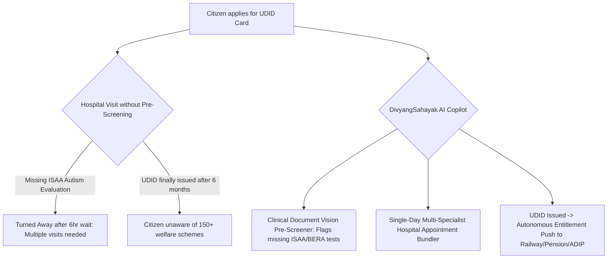

# Research Track 19: UDID (Swavlamban) — Disability Welfare Certification & Entitlement Navigator

**Target Public Infrastructure:** UDID Portal (`swavlambanindia.gov.in` / Department of Empowerment of Persons with Disabilities) / RPwD Act 2016  
**Core Problem Area:** 2.68 crore Persons with Disabilities (PwD); complex clinical prerequisite tests (BERA, ISAA, CARS) causing repeated hospital visits; lack of multi-specialist medical board synchronization; "UDID Issued, Benefits Denied" paradox where certified percentage fails to automatically trigger central/state welfare schemes.

---

## 1. Executive Pitch & Citizen Problem Statement

### The Problem
Obtaining a Unique Disability ID (UDID) card and claiming rightful welfare in India is exhausting:
1. **The Specialist Scramble:** A parent with an autistic child or a citizen with hearing loss arrives at the District Hospital only to be turned away after waiting 6 hours because they don't have an ISAA psychometric score or BERA audiometry report.
2. **The Medical Board Bottleneck:** Boards sit only on specific days. Bedridden citizens are forced into traumatic physical trips because no tele-assessment routing exists.
3. **The Scheme Fragmentation:** Once a UDID card is issued (e.g. *Locomotor Disability, 62%*), the citizen must independently discover and apply to 8 separate ministries for Railway concessions, ADIP motorized wheelchairs, state disability pensions, and income tax deductions under Section 80U.

### The Solution: "DivyangSahayak AI"
An accessible, dignity-first disability certification navigator and entitlement passport powered by OpenAI:
- **Multimodal Accessible UI:** Speech-to-speech in 22 languages and real-time Indian Sign Language (ISL) avatar guidance.
- **Clinical Document Pre-Screener:** Analyzes doctor prescriptions, flags missing diagnostic prerequisites (e.g. ISAA/BERA), and bundles multiple specialist appointments (Psychiatrist + ENT) into a single hospital visit.
- **Autonomous Entitlement Push:** The moment a UDID certificate is generated, the AI evaluates 150+ central/state welfare rules and auto-enrolls the citizen into their **Railway Concession Pass, Monthly State Pension, ADIP Assistive Device Requisition, and Form 10-IA Tax Exemption** in 1 click.

---

## 2. Technical Failure Modes in UDID Ecosystem



---

## 3. The 60-Second Citizen Demo Journey

1. **Step 1 (0:00 - 0:15):** Ramesh (farmer, Madurai) sends a voice note in rural Tamil for his 7yo non-verbal autistic son Kavin: *"Thambi pesave maatengran, doctor indha seetu kuduthaanga..."*
2. **Step 2 (0:15 - 0:30):** DivyangSahayak AI's Vision engine parses the prescription in 2.8 seconds:
   - *Clinical Diagnosis:* Delayed speech, poor eye contact.
   - *Prerequisite Check:* Flags that an **ISAA (Indian Scale for Assessment of Autism) Psychometric Score** is required.
   - *Action:* Automatically books a single consolidated slot at Govt Rajaji Hospital DEIC for both the Psychiatrist and Clinical Psychologist with a Priority Fast-Track QR.
3. **Step 3 (0:30 - 0:45):** **Simulating Medical Board Approval (78% Autism Score):**
4. **Step 4 (0:45 - 1:00):** **The Entitlement Unlock:** In 1 click, system auto-activates:
   - Tamil Nadu Monthly Disability Maintenance Allowance (₹2,000/month DBT).
   - Southern Railway Concession e-Pass.
   - Free Sensory Learning Kit requisition from ALIMCO under ADIP scheme.

---

## 4. OpenAI / Codex Native Architecture

```
[Voice Note (IndicSpeech) / Prescription Photo / UDID XML]
                            │
                            ▼
    [Clinical Document Vision & Rule Classifier (GPT-4o)]
  (Maps 21 RPwD Disabilities vs Gazette Assessment Guidelines)
                            │
                            ▼
    [Specialist Board Bundler & Route Planner (Codex)]
 ┌──────────────────────────────────────────────────┐
 │ • Pre-requisite Diagnostic Test Aggregator       │
 │ • Consolidated Multi-Doctor Calendar Allocator   │
 └──────────────────────────────────────────────────┘
                            │
                            ▼
     [Autonomous Welfare Entitlement Passport Engine]
 ┌──────────────────────────────────────────────────┐
 │ • 150+ Central & State Scheme Eligibility Matrix │
 │ • 1-Click Auto-Enrolment Payload Generator       │
 └──────────────────────────────────────────────────┘
```

---

## 5. Synthetic Mock Schema (For Hackathon Prototype)

```json
{
  "applicant_id": "UDID-TN-2026-00918",
  "name": "Kavin Ramesh (Age 7)",
  "disability_assessment": {
    "category": "AUTISM_SPECTRUM_DISORDER",
    "certified_percentage": 78,
    "benchmark_disability": true,
    "support_needs": "HIGH_SUPPORT_NEEDS"
  },
  "auto_activated_entitlements": [
    {
      "scheme": "Tamil Nadu Maintenance Allowance",
      "monthly_benefit_inr": 2000,
      "dbt_status": "MAPPED_TO_FATHER_ACCOUNT"
    },
    {
      "scheme": "Indian Railways Divyangjan Concession Pass",
      "discount": "75% in AC 3-Tier & Sleeper with 1 Escort",
      "pass_id": "SR-CONC-2026-99120"
    },
    {
      "scheme": "ADIP Scheme Assistive Equipment",
      "requisition": "Sensory & Developmental Therapy Kit (ALIMCO)"
    }
  ]
}
```

---

## 6. The 2-Minute Video Pitch Script

- **Minute 1 (Citizen Experience):** "In India, parents of children with disabilities spend months making repeated hospital visits, waiting in crowded corridors, only to be told they are missing a specific clinical test. Meet DivyangSahayak. A father in Tamil Nadu sends a photo of a doctor's slip. The AI identifies the missing autism assessment, books a single consolidated hospital appointment, and the moment the certificate is approved, automatically pushes his monthly ₹2,000 disability pension, free railway pass, and assistive device application to his phone."
- **Minute 2 (Engineering & Codex):** "We used Codex to implement the RPwD Act 2016 clinical rules engine across all 21 recognized disabilities and our multi-specialist calendar bundler. OpenAI GPT-4o powers the accessible multilingual voice assistant and medical document classifier. This brings speed, dignity, and automatic welfare access to 2.68 crore Persons with Disabilities in India."
