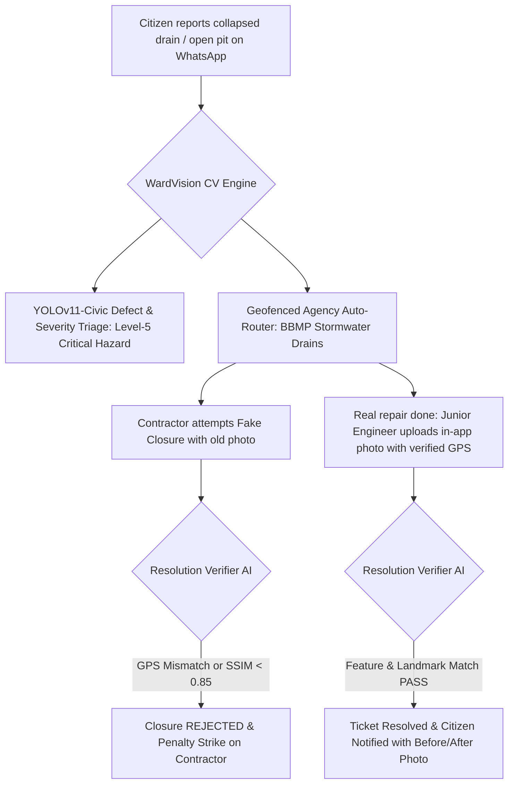

# Research Track 20: Municipal Urban Local Bodies (ULBs) — Property Tax Mutation & Civic Grievance Geo-AI Resolver

**Target Public Infrastructure:** Urban Local Bodies (ULBs: BBMP, BMC, MCD, GHMC, PMC) / Smart Cities Mission / Swachhata 311  
**Core Problem Area:** Property tax mutation decoupled from registered Sub-Registrar sale deeds; spatial survey number vs Municipal Property ID (PID) confusion; physical inspection rent-seeking; "fake closure" crisis in civic grievance apps where contractors upload blurry or fake photos to beat SLA timers.

---

## 1. Executive Pitch & Citizen Problem Statement

### The Problem
Urban citizens face continuous friction with their local municipal corporations:
1. **The Property Tax Mutation Gridlock:** A citizen buys a flat and registers the sale deed at the Sub-Registrar Office (SRO). But the Municipal Property Tax Khata remains in the seller's name. Transferring it requires manual ward visits, mutation challans, and bribing revenue inspectors for physical site measurements.
2. **The "Fake Closure" Civic Grievance Crisis:** When a citizen reports a dangerous pothole or collapsed drain on municipal 311 apps, sanitation contractors beat their 24-hour SLA penalty by uploading fake, blurry, or recycled photos of clean streets taken elsewhere, closing the ticket without doing any actual repair work.
3. **Jurisdictional Ping-Pong:** Potholes on arterial roads are rejected as "PWD / NHAI jurisdiction" with zero automated inter-agency transfer.

### The Solution: "NagarikMitra & WardVision AI"
An autonomous municipal mutation pipeline and computer-vision civic audit copilot powered by OpenAI:
- **Zero-Touch Property Mutation:** Listens to SRO registered sale deeds -> AI parses parties, extent, and boundaries -> Matches Revenue Survey No. with Municipal Master GIS PID -> Runs 15-day digital public notice -> Automatically issues digitally signed **e-Khata Certificate**.
- **WardVision Civic Anti-Fraud Engine:** Citizen sends a photo/video of a civic hazard on WhatsApp -> AI detects defect type & severity (Level 1–5 Emergency Alert), routes to exact geofenced agency (BBMP vs PWD vs Jal Board) -> When contractor submits completion photo, a **Siamese Visual Matcher** compares before/after features and rejects fake closures with automated penalties.

---

## 2. Technical Failure Modes in Municipal Urban Governance



---

## 3. The 60-Second Citizen Demo Journey

1. **Step 1 (0:00 - 0:15):** Citizen (Amit, Bengaluru) sends a 5-second video of an open 6-foot drain collapse on a busy junction in Indiranagar via WhatsApp.
2. **Step 2 (0:15 - 0:30):** WardVision CV analyzes the video in 2 seconds:
   - *Defect:* Stormwater Drain Collapse (Confidence: 96.4%).
   - *Severity:* **LEVEL 5 - CRITICAL LIFE HAZARD (Red Alert)**.
   - *Routing:* Auto-dispatches ticket #BBMP-CRIT-0914 to Assistant Executive Engineer (SWD) and Traffic Police.
3. **Step 3 (0:30 - 0:45):** **Simulating Contractor Fake Closure:** Contractor uploads a recycled photo of a clean footpath taken 1.2 km away. The AI's Siamese Visual Matcher rejects the closure for GPS mismatch and low structural similarity (SSIM: 0.12).
4. **Step 4 (0:45 - 1:00):** **Real Verification & Auto-Mutation:** Real repair photo is verified by visual landmark matching. System also demonstrates **1-Click Property Tax Mutation** from a registered sale deed to e-Khata in 30 seconds.

---

## 4. OpenAI / Codex Native Architecture

```
[Citizen Video/Photo + Live GPS + Sale Deed PDF]
                         │
                         ▼
     [Computer Vision Hazard Classifier & SRO Parser]
  (YOLOv11-Civic + GPT-4o Vision + Spatial GIS Mapper)
                         │
                         ▼
     [Autonomous Municipal Rules Engine (Codex)]
 ┌──────────────────────────────────────────────────┐
 │ • GIS Cadastral Matching (Survey No <-> PID)     │
 │ • Geofenced Multi-Agency Dispatcher (ULB/PWD/NHAI│
 │ • 15-Day Digital Public Objection Engine         │
 └──────────────────────────────────────────────────┘
                         │
                         ▼
     [Anti-Fraud Resolution Verifier (Siamese AI)]
 ┌──────────────────────────────────────────────────┐
 │ • EXIF GPS & Landmark Anchor Matcher             │
 │ • SSIM Visual Difference Validator               │
 │ • Digitally Signed e-Khata / Resolution Pass     │
 └──────────────────────────────────────────────────┘
```

---

## 5. Synthetic Mock Schema (For Hackathon Prototype)

```json
{
  "ticket_id": "BBMP-CRIT-2026-0914",
  "ward_number": 89,
  "ward_name": "Jogupalya, Indiranagar",
  "defect_analysis": {
    "defect_type": "STORMWATER_DRAIN_COLLAPSE",
    "hazard_severity": "LEVEL_5_CRITICAL",
    "coordinates": {"lat": 12.9716, "lng": 77.6412},
    "assigned_agency": "BBMP_STORMWATER_DRAINS",
    "emergency_sla_hours": 24
  },
  "anti_fraud_audit": {
    "closure_attempt_1": {
      "submitted_by": "Contractor XYZ",
      "ssim_score": 0.12,
      "gps_match": false,
      "verdict": "FRAUDULENT_CLOSURE_REJECTED"
    },
    "verified_closure": {
      "verified_by": "Junior Engineer",
      "ssim_score": 0.91,
      "landmark_match": true,
      "verdict": "RESOLUTION_CONFIRMED"
    }
  }
}
```

---

## 6. The 2-Minute Video Pitch Script

- **Minute 1 (Citizen Experience):** "When you report a dangerous pothole or collapsed drain on a city app, contractors often upload a fake photo of a clean street to beat their SLA, closing the ticket while the hazard remains. And when you buy a house, getting the Property Tax Khata transferred takes months of running around ward offices. Meet NagarikMitra and WardVision. A citizen sends a 5-second video of an open pit. The AI classifies it as a Level-5 emergency, routes it to the exact engineer, and when a contractor tries to upload a fake photo, the AI detects the fraud and blocks closure until real before/after proof is verified."
- **Minute 2 (Engineering & Codex):** "We used Codex to build our spatial municipal GIS router and the Siamese visual difference matcher. OpenAI GPT-4o powers our deed-to-tax auto-mutation pipeline and computer vision hazard triage. This provides unprecedented accountability and transparency for urban governance across India's Smart Cities."
